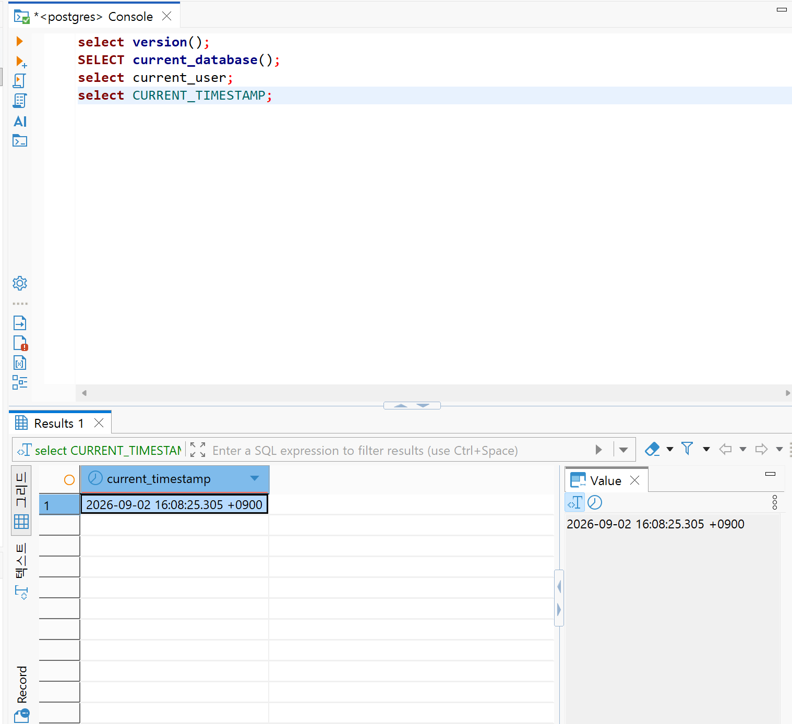
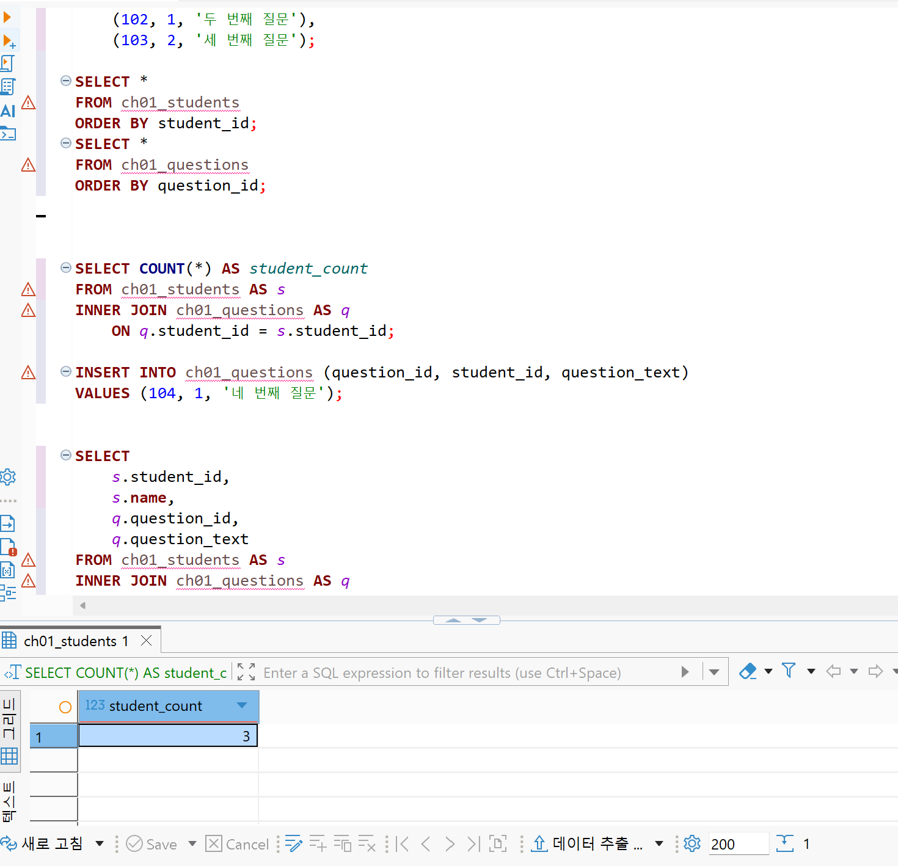
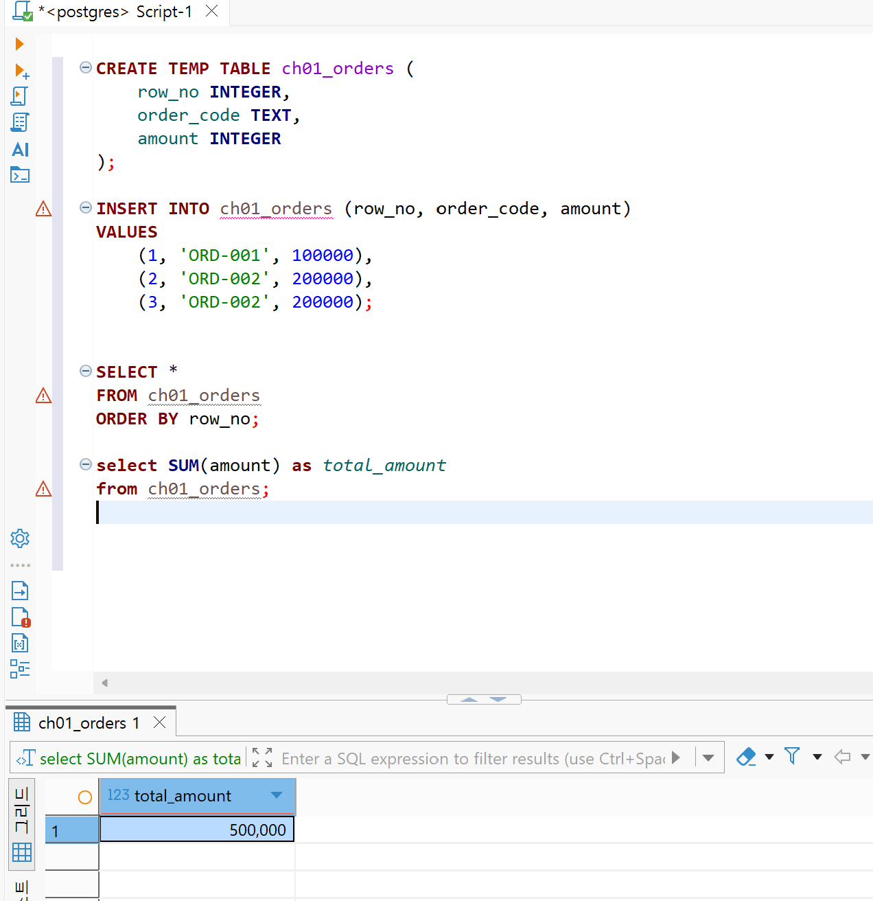
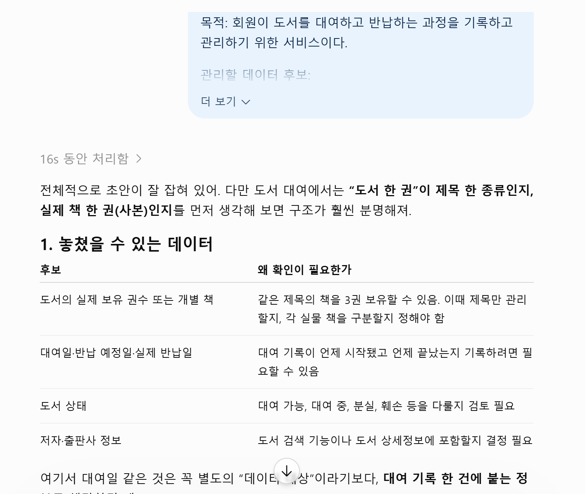

# Chapter 01 확장 실습 답안 템플릿

> **과제:** AI 시대에 데이터베이스를 왜 배워야 하는가  
> **사용 방법:** 이 파일을 내려받아 **본인의 GitHub 저장소**에 `chapter01_answer.md`라는 이름으로 저장한 뒤 답안을 작성합니다.  
> **제출 방법:** LMS에는 파일을 업로드하지 않고, **본인 GitHub 저장소의 `chapter01_answer.md` 파일 URL**을 제출합니다.

---

## 0. 학생 정보

| 항목 | 작성 내용 |
| --- | --- |
| 학번 | 2025-11869 |
| 이름 | 이윤아 |
| GitHub 계정 | 0524youna-gif |
| 과제 작성일 | 2026/09/07 |
| 사용한 AI 도구 | chat gpt |

> 실제 비밀번호, API Key, 전체 DB 접속 URL, 개인정보는 이 파일이나 캡처 화면에 기록하지 않습니다.

---

# 1. PostgreSQL 실행 환경 확인

## 1-1. 실행한 SQL

```sql
SELECT version();
SELECT current_database();
SELECT current_user;
SELECT CURRENT_TIMESTAMP;
```

## 1-2. 실행 결과 기록

```text
PostgreSQL 버전: PostgreSQL 18.6 on x86_64-windows, compiled by msvc-19.44.35228, 64-bit
현재 데이터베이스: postgres
현재 사용자: postgres
현재 시각:2026-09-02 16:08:25.305 +0900
```

## 1-3. 내가 확인한 내용

1. SQL을 작성하는 프로그램과 PostgreSQL은 같은 프로그램인가요?

```text
나의 답: PostgreSQL은 데이터를 저장하는 창고이고 SQL 작성 프로그램은 데이터베이스를 경유해서 sql을 작성 및 확인할 수 있게 하는 관리 프로그램.
```

2. `current_database()` 결과는 무엇을 의미하나요?

```text
나의 답: 접속한 데이터베이스 
```

3. SQL이 실행되었다는 사실만으로 데이터 내용도 올바르다고 할 수 있나요?

```text
나의 답: 아닐 것 같음. 알맹이가 틀려도 실행은 될 수 있을 것 같음. 
```

## 1-4. 증거 화면

아래 경로에 캡처 이미지를 저장하는 것을 권장합니다.

```text
assignments/chapter01/images/step01_environment.png
```

이미지를 저장했다면 아래 링크의 파일명을 실제 파일명에 맞게 수정합니다.

```markdown

```

**이미지 삽입 위치:**

<!-- 아래 줄의 주석을 지우고 실제 이미지 Markdown을 넣어도 됩니다. -->

`여기에 STEP 1 증거 화면을 삽입하세요.`

--- 


# 2. Chapter 01 핵심 내용 복습

교재 문장을 그대로 복사하지 말고 자신의 말로 작성합니다.

| 본문의 핵심 | 나의 설명 |
| --- | --- |
| AI가 SQL을 만들어도 DB를 배워야 한다 | 사람이 항상 결과값에 책임져야 하고 AI가 매순간 정확한 것이 아니기 때문. |
| 데이터 구조가 중요하다 | 데이터를 어떤 기준으로 나누고 연결하는지에 따라 정보를 분석하는 방식이 달라짐.  |
| SQL 결과를 검증해야 한다 | 같은 결과가 나와도 조건이나 계산 과정이 잘못되었을 수 있으므로 원하는 데이터가 맞는지 직접 확인해야함.   |
| 데이터 품질이 AI 답변 품질에 영향을 준다 | 데이터에 오류가 있으면 AI도 정확한 답을 만들기가 어려움. |
| 저장 방식은 데이터 양만 보고 선택하지 않는다 | 데이터를 어떻게 사용하고, 얼마나 자주 수정하거나 빠르게 찾아야 하는지도 함께 고려해야함. |

## 가장 중요하다고 생각한 한 문장

```text 
사람은 데이터의 의미와 결과를 확인해야 한다

```

---

# 3. 실행 성공과 결과 정확성의 차이

## 3-1. SQL 실행 전 예상

학생 A는 질문 2개, 학생 B는 질문 1개, 학생 C는 질문이 없습니다.

```text
전체 학생 수: 3 명
전체 질문 수: 3 개
질문이 있는 학생 수: 2 명
질문이 없는 학생 수: 1 명
```

## 3-2. 임시 테이블 생성 및 데이터 입력 완료 확인

- [ ] `ch01_students` 생성
- [ ] `ch01_questions` 생성
- [ ] 학생 3명 입력
- [ ] 질문 3건 입력
- [ ] 두 테이블의 데이터를 직접 조회

## 3-3. 잘못된 학생 수 SQL 실행 결과

실행한 SQL:

```sql
SELECT COUNT(*) AS student_count
FROM ch01_students AS s
INNER JOIN ch01_questions AS q
    ON q.student_id = s.student_id;
```

실행 결과: 3

```text

```

## 3-4. JOIN 상세 결과 관찰

```text
학생 A가 나타난 행 수: 2
학생 B가 나타난 행 수: 1
학생 C가 나타난 행 수: 0 
```

다음 질문에 답합니다.

### Q1. 학생 C가 왜 결과에서 사라졌나요?

```text
질문을 한 학생만이 집계되었기 때문
```

### Q2. 학생 A가 왜 여러 행으로 나타났나요?

```text
한 질문 당 학생 한명으로 간주됨. 
```

### Q3. 위 `COUNT(*)`가 실제로 세고 있었던 것은 무엇인가요?

```text
질문 수 
```

### Q4. 결과 숫자가 우연히 실제 학생 수와 같아도 바로 믿으면 안 되는 이유는 무엇인가요?

```text
위와 같이 값이 동일하더라도 잘못된 방식으로 도출될 수 있음. 
```

## 3-5. 질문 한 건을 추가한 뒤 다시 실행

추가한 데이터:

```text
INSERT INTO ch01_questions (question_id, student_id, question_text)
VALUES (104, 1, '네 번째 질문');

첫번째 학생의 또 다른 질문.

```

다시 실행한 결과:

```text
AI SQL 결과:4
실제 학생 수:3
```

### 결과 해석

```text
데이터가 바뀐 뒤 무엇이 달라졌는지: 학생 A의 질문이 하나 더 늘었음. 학생 카운트 수는 4로 변경. 

실제 학생 수는 왜 그대로인지: 기존 학생의 질문이 추가된 것이므로 학생 수는 그대로이다. 

이 실험을 통해 알게 된 점: SQL실행 여부와 결과의 정답 여부는 구분해야 함. 
```

## 3-6. 학생 테이블을 직접 센 결과

```sql
SELECT COUNT(*) AS student_count
FROM ch01_students;
```

결과:

```text
3
```

### 두 SQL의 차이를 내 말로 설명

```text
첫 번째 SQL은 질문의 총 개수 을 세고 있었다.

두 번째 SQL은 학생 수을 세고 있었다.

따라서 SQL을 검토할 때는 문법보다 먼저
나의 목적과 그에 부합하는 sql을 확인해야 한다.
```

## 3-7. 증거 화면

권장 경로:

```text
assignments/chapter01/images/step03_join_result.png
```

`여기에 STEP 3 핵심 증거 화면을 삽입하세요.`

---

# 4. 잘못된 데이터가 결과를 바꾸는 과정

## 4-1. 주문 데이터 확인

다음 데이터를 입력한 뒤 실제 결과를 확인합니다.

```text
ORD-001, 100000
ORD-002, 200000
ORD-002, 200000
```

## 4-2. 실행 전 예상

업무적으로 주문이 `ORD-001`, `ORD-002` 두 건이고 `order_code`가 주문을 고유하게 구분한다고 **가정할 경우** 예상 합계:

```text
300,000 원
```

> 위 가정 자체가 실제 업무 규칙인지 확인해야 한다는 점도 기억합니다.

## 4-3. SQL 합계

```sql
SELECT SUM(amount) AS total_amount
FROM ch01_orders;
```

실제 결과:

```text
50,000 원
```

## 4-4. 결과 해석

### `SUM` 문법 자체가 잘못된 것인가요?

```text
아니오. 
```

### 결과 차이의 원인은 무엇인가요?

```text
(내) 가정과 실행 문법의 차이
```

### SQL이 정확하게 실행되어도 업무 숫자가 잘못될 수 있는 이유를 설명하세요.

```text
원하는 답을 도출하려면 SQL의 문법과 기준을 정확하게 인지하는 게 필요함. 
```

## 4-5. AI에게 같은 데이터를 분석시킨 결과

AI가 계산한 합계:

```text
30,000
```

AI가 중복 가능성을 언급했나요?

```text
네.
```

AI가 `ORD-002` 두 행이 실제 두 주문인지 중복 입력인지 스스로 확정할 수 있나요? 이유도 적으세요.

```text
제가 AI를 돌려본 결과 "ORD-002가 중복데이터라면 ..." 이라는 가정을 사용하였지 확정하지는 않았습니다. 또한 AI에게 규칙을 알려주지 않았기 떄문에 확정할 수 없습니다.
```

추가로 확인해야 할 업무 규칙:

```text
1. order_code가 주문을 고유하게 구분하는지 확인해야 함.
2. ORD-002 중복이 입력 실수인지 재주문인지 확인해야 함.
3. 집계할 때 중복을 제거할지 그대로 합산할지 기준이 필요함.
```

내가 최종적으로 내린 판단:

```text
지금 합계를 그대로 믿을 수 없음. 담당자에게 order_code 중복 허용 여부를 먼저 확인해야 함. 확인 후에 집계 기준을 정해야 함.
```

## 4-6. 증거 화면

권장 경로:

```text
assignments/chapter01/images/step04_duplicate_result.png
```

`여기에 STEP 4 핵심 증거 화면을 삽입하세요.`

---

# 5. 파일·스프레드시트·DBMS 선택 연습

각 사례에 대해 **AI에게 묻기 전에 먼저 본인의 판단을 작성**합니다.

## 사례 A. 개인 독서 기록

```text
나의 선택: 파일   
선택 이유: 개인 기록이고 기록 내용이 적다. 
어떤 조건이 추가되면 다른 방식으로 바꿀 것인지: 여러 사용자가 동시에 접근하는 경우.
```

## 사례 B. 동아리 행사 신청 명단

```text
나의 선택: 스프레드시트
선택 이유: 비교적 다루는 내용이 늘어났지만 단기간 운영되기 때문에. 
어떤 조건이 추가되면 다른 방식으로 바꿀 것인지: 쭉 운영되어야 한다면 DBMS로 변경할 것 같다
```

## 사례 C. 온라인 강의 서비스

```text
나의 선택: DBMS
선택 이유: 학생과 강사 구분.변경이력을 조회할 수 있고 권한과 복구가 중요하기 떄문에. 
어떤 조건이 추가되면 다른 방식으로 바꿀 것인지: 더 추가되어도 DBMS를 이용할 것 같다.
```

## 판단 기준 체크

- [ ] 데이터 증가
- [ ] 여러 사용자의 동시 수정
- [ ] 데이터 사이의 관계
- [ ] 반복 조회와 집계
- [ ] 정확성·일관성
- [ ] 변경 이력
- [ ] 권한 구분
- [ ] 백업·복구
- [ ] 웹·앱에서 지속 사용

### 데이터가 적으면 무조건 스프레드시트를 사용해야 하나요?

```text
나의 답:
```
셋 다 사용해도 상관없을 것 같다. 필요와 조건에 의해 선택하면 된다. 
---

# 6. 나만의 서비스 데이터 구조 초안

> 이 내용은 이후 Chapter에서 계속 확장할 수 있으므로 신중하게 작성합니다.

## 6-1. 서비스 정의

```text
서비스 이름: 도서 대여 관리 서비스

이 서비스는
회원이 도서를 대여하고 반납하는 과정을 기록하고 관리하기 위한 서비스이다.
```

## 6-2. 관리할 데이터 후보

```text
1. 회원
2. 도서
3. 대여 기록
4. 반납 상태
5. 도서 분류
```

## 6-3. 한 행의 의미

| 데이터 후보 | 한 행의 의미 |
| --- | --- |
|회원 데이터 한 행 | 회원 한 명의 정보  |
|도서 데이터 한 행 | 도서 한 권의 정보|
|대여기록  | 한 회원이 특정 도서를 대여한 사건 |
|도서 분류 | 도서 분류 정보|


## 6-4. 관계를 자연어로 설명

```text
1. 한 회원은 여러 권의 도서를 대여할 수 있다.
2. 한 도서는 여러 번 대여될 수 있다.
3. 하나의 대여 기록은 한 회원과 한 도서를 연결한다.
4. 하나의 도서 분류에는 여러 도서가 포함될 수 있다.
```

## 6-5. 아직 결정하지 않은 정책

```text
Q1. 회원 이메일은 반드시 고유해야 하는가?
Q2.같은 회원이 같은 도서를 동시에 여러 권 대여할 수 있는가?
Q3.반납 기한이 지난 도서는 연체 상태로 따로 관리하는가?
```

> 확정되지 않은 정책을 AI가 임의로 결정한 경우 그대로 받아들이지 않습니다.

---

# 7. AI를 검토자로 활용하기

## 7-1. 내가 AI에게 전달한 핵심 프롬프트

개인정보나 비밀번호 등 민감한 내용은 제거한 뒤 기록합니다.

```text
나는 데이터베이스를 처음 배우는 학생입니다.
아직 ERD나 정규화를 배우기 전입니다.
내가 생각한 서비스는 다음과 같습니다.

서비스: 도서 대여 관리 서비스
목적: 회원이 도서를 대여하고 반납하는 과정을 기록하고 관리하기 위한 서비스이다.

...... 등등 위에 기입한 내용을 넣었습니다. 


지금 단계에서는 완성된 SQL을 만들지 말고,

1\. 내가 놓친 데이터가 있는지,

2\. 서로 다른 의미의 데이터를 한 항목으로 섞은 것은 없는지,

3\. 추가로 확인해야 할 업무 질문은 무엇인지,

4\. 파일·스프레드시트·관계형 DBMS 중 무엇이 적합해 보이는지

초보자가 이해할 수 있게 검토해 주세요.

확정되지 않은 정책은 임의로 정답처럼 결정하지 마세요.
```

## 7-2. AI의 주요 제안과 나의 판단

최소 5개를 작성합니다.

| AI의 제안 | 수용 / 수정 / 거절 | 나의 판단 근거 |
| --- | --- | --- |
| 도서 한 권을 제목인지 살제 권수당 인지 구분필요 제안. | 수용 | 생각치 못했던 부분이고 타당하다.  |
|  반납 상태를 별도 데이터로 두기보다 대여 기록의 상태로 생각해 보라는 제안| 수용 | 대여기록에 반납상태가 들어갈 수 있고, 데이터 정리가 쉬워질 것같아 수용. |
|한 번의 대여 기록에 여러 권의 도서를 함께 넣을 수 있는지 결정해야 한다는 제안 | 수용 | 기록 방식은 여러가지가 될 수 있겠으나 한 번의 대여에 여러권의 도서가 들어갈 수 있는 것은 합리적이다.   |
| 저자와 출판사 정보도 관리 대상으로 추가할 수 있다는 제안 |거절  |  단순 대여 서비스에는 과하다 |
|분실·훼손된 도서의 상태도 관리할지 확인하라는 제안  | 수용 | 예상하지 못했던 부분을 짚었고 타당하다.  |

## 7-3. AI에게 자기 답변을 다시 비판하도록 요청한 결과

첫 번째 답변과 달라진 점:

```text
처음 답변에서는 실제 도서관에서 흔히 사용하는 방식을 기준으로 같은 제목의 도서를 여러 권 보유하고 각 책을 구분해 관리할 수 있다고 예시를 들었다. 다시 검토한 뒤에는 이것이 내 서비스에서 확정된 정책은 아니라는 점을 분명히 했다. 또한 반납 상태를 별도의 관리 대상처럼 보기보다 대여 기록에 붙는 정보일 가능성이 높으며 두 곳에 같은 상태를 저장하면 데이터가 중복될 수 있다고 수정했다.
```

AI가 처음에 임의로 가정했던 내용:

```text
같은 제목의 도서를 여러 권 보유한다는 점, 실제 책 한 권씩을 구분해 관리한다는 점, 도서 상태를 따로 관리해야 한다는 점
```

추가로 업무 담당자에게 확인해야 한다고 판단한 내용:

```text
같은 제목의 도서를 여러 권 보유할 것인지, 여러 권이 있다면 실제 책 한 권씩을 구분할 것인지 확인해야 한다. 회원 이메일을 로그인이나 연락에 사용할 것인지도 정해야 한다.
```

## 7-4. AI 활용에 대한 나의 평가

```text
가장 유용했던 부분:내가 처음에는 회원, 도서, 대여 기록만 생각했는데 AI가 대여일,반납 예정일,실제 반납일처럼 대여 기록에 포함될 수 있는 정보를 생각하게 해 준 점이 유용.

수정하거나 거절한 부분:AI가 같은 제목의 도서를 여러 권 보유한다고 가정한 부분과, 실제 책을 각각 구분해 관리해야 한다는 듯한 표현은 수정함.

그렇게 판단한 근거:아직 서비스의 규모와 운영 방식이 정해지지 않았기 때문이다. 간단한 도서 대여 관리 서비스라면 제목 단위로 관리할 수도 있고, 반납 상태도 대여 기록 안에서 관리할 수 있다. 정하지 않은 정책을 일반적인 사례만 보고 확정하면 이후 데이터 구조가 불필요하게 복잡해질 수 있다고 판단함.

AI가 없었다면 놓쳤을 가능성이 있는 질문:같은 제목의 도서를 여러 권 보유할 때 어떻게 구분할 것인가, 반납 상태를 대여 기록과 별도로 저장하면 중복되지 않는가가 정말 필요한 정보인지는 AI가 없었다면 놓쳤을 가능성이 있음.
```

## 7-5. AI 활용 증거 화면

권장 경로:

```text
assignments/chapter01/images/step07_ai_review.png
```

AI 대화 전체를 캡처할 필요는 없습니다. 핵심 요청과 검토 과정이 보이는 화면 1장 정도면 충분합니다.



---

# 8. 기준 데이터·파생 데이터·AI 생성 결과 구분

내 서비스에 맞게 작성합니다.

| 구분 | 내 서비스의 예 | 판단 이유 |
| --- | --- | --- |
| 기준 데이터 | 대여 기록 | 실제 있었던 대여를 그대로 담은 원본 데이터임 |
| 파생 데이터 | 월별 대여 건수 | 대여 기록을 모아서 계산한 데이터임 |
| AI 생성 결과 | AI가 만든 이달의 인기 도서 분석 | 데이터와 지시를 바탕으로 AI가 새로 만든 결과임 |

### 기준 데이터가 변경되면 파생 데이터는 어떻게 해야 하나요?

```text
파생 데이터도 다시 계산해야 함.
```

### AI 결과만 있고 원본 데이터가 없다면 결과를 충분히 검증할 수 있나요?

```text
검증할 수 없음. 원본이 없으면 맞는지 확인할 방법이 없음.
```

---

# 9. 최종 성찰

아래 세 문장은 반드시 **본인의 말**로 작성합니다.

```text
1. SQL이 실행되어도 결과를 바로 믿으면 안 되는 이유는
   문법이 맞아도 기준이 다르면 결과가 틀릴 수 있기 때문 이다.

2. AI를 데이터베이스 학습에 활용할 때 가장 중요한 것은
   AI 결과를 그대로 믿지 않고 내가 직접 확인하는 것 이다.

3. 이번 실습 이후 내가 더 확인하고 싶은 것은
   중복 데이터를 실무에서는 어떻게 처리하는지 이다.
```

## 이번 Chapter에서 새롭게 알게 된 점 3가지

```text
1. SQL이 실행됐다고 결과가 맞는 건 아님.
2. 숫자가 같아도 계산 기준이 다를 수 있음.
3. AI도 확정 안 된 부분을 임의로 가정할 수 있음.
```

## 아직 이해가 명확하지 않은 부분

```text
1. 기준 데이터와 파생 데이터를 실무에서 어떻게 나누는지 헷갈림.
2. ERD나 정규화를 아직 안 배워서 데이터를 얼마나, 어떻게 나눠야 할지 모르겠음.
```

---

# 10. 제출 전 자기 점검

- [ ] PostgreSQL 실행 화면을 확인했다.
- [ ] SQL 실행 전에 예상 결과를 먼저 작성했다.
- [ ] `INNER JOIN` 예제에서 누락과 반복을 설명할 수 있다.
- [ ] 숫자가 우연히 같아도 의미가 다를 수 있음을 설명했다.
- [ ] 중복 데이터가 집계 결과에 미치는 영향을 확인했다.
- [ ] 저장 방식을 데이터 양만으로 판단하지 않았다.
- [ ] 개인 서비스 주제를 하나 정했다.
- [ ] 데이터 후보와 한 행의 의미를 작성했다.
- [ ] 미확정 정책을 최소 3개 작성했다.
- [ ] AI 제안을 수용·수정·거절로 구분했다.
- [ ] AI 제안에 대한 판단 근거를 작성했다.
- [ ] 기준 데이터·파생 데이터·AI 결과를 구분했다.
- [ ] 핵심 증거 이미지가 Markdown에서 정상적으로 보인다.
- [ ] 비밀번호·API Key·개인정보가 노출되지 않았다.

---

# 11. LMS 제출 정보

## 내 GitHub 답안 파일 URL

아래에는 **교수자 템플릿 URL이 아니라 본인이 작성한 답안 파일의 GitHub URL**을 기록합니다.

```text
https://github.com/<본인-GitHub-ID>/<본인-저장소>/blob/main/assignments/chapter01/chapter01_answer.md
```

내 실제 제출 URL:

```text
https://github.com/0524youna-gif/2602database/blob/main/assignments/chapter01/chapter01_answer.md
```

> LMS에는 위 **본인 저장소의 `chapter01_answer.md` 파일 URL 하나**를 제출합니다.

---

## 권장 학생 저장소 구조

```text
<본인-저장소>/
└── assignments/
    └── chapter01/
        ├── chapter01_answer.md
        └── images/
            ├── step01_environment.png
            ├── step03_join_result.png
            ├── step04_duplicate_result.png
            └── step07_ai_review.png
```

이 구조를 사용하면 이후 Chapter 02, Chapter 03도 같은 방식으로 계속 추가할 수 있습니다.
