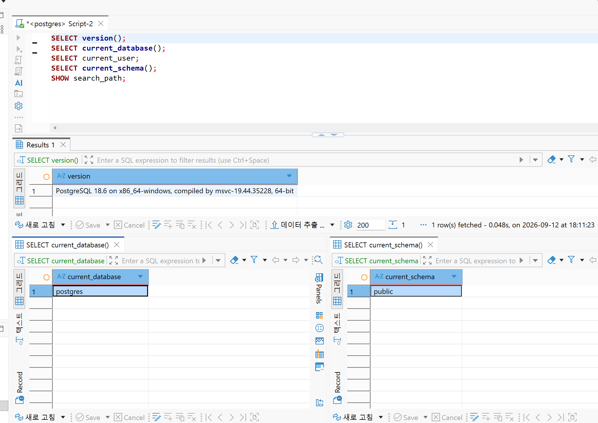
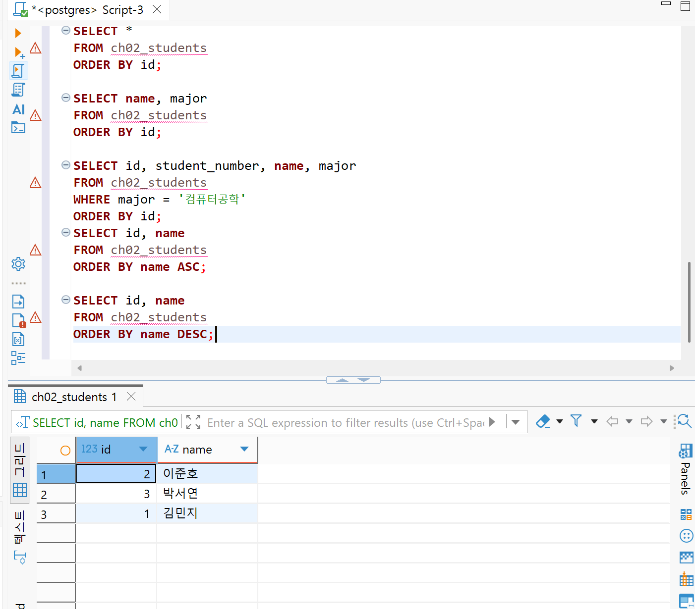
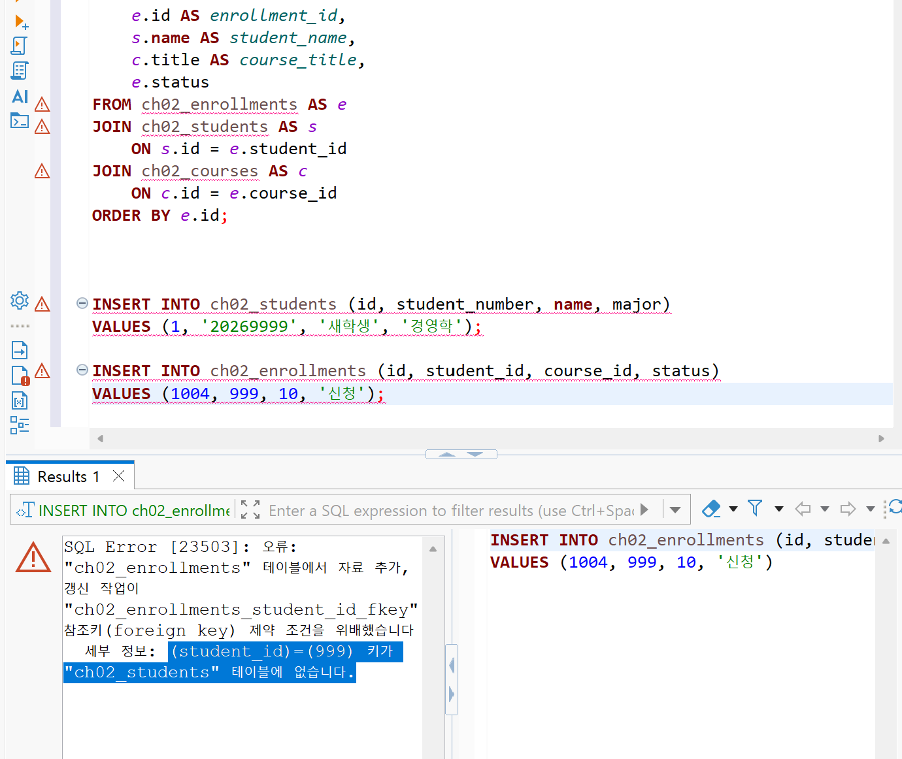
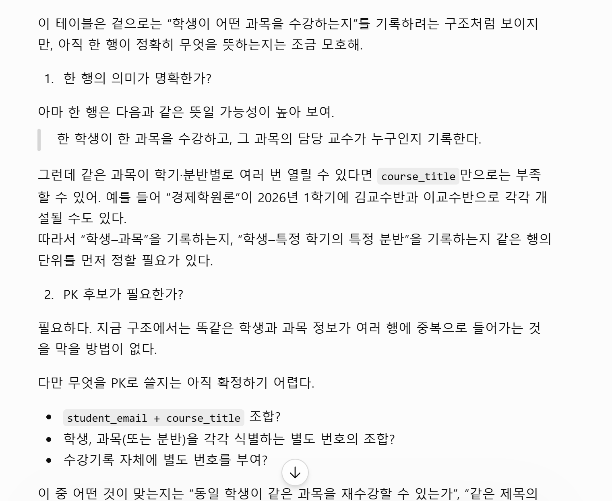

# Chapter 02 확장 실습 답안 템플릿

> **과제:** 데이터와 DBMS의 기본 개념  
> **사용 방법:** 이 파일을 내려받아 본인의 GitHub 저장소에 `chapter02_answer.md`라는 이름으로 저장한 뒤 실습하면서 바로 작성합니다.  
> **제출 방법:** LMS에는 파일을 직접 업로드하지 않고, **본인 GitHub 저장소의 `chapter02_answer.md` 파일 URL**을 제출합니다.

---

## 제출 전 개인정보 주의

LMS에서 제출자를 확인할 수 있으므로 이 공개 Markdown 파일에 학번이나 실명을 반드시 적을 필요는 없습니다.

```text
GitHub 계정 또는 별칭: 0524youna
과제 작성일: 20260912
사용한 AI 도구:chatgpt
```

> 실제 비밀번호, API Key, 전체 DB 접속 URL, 개인정보가 포함된 화면은 올리지 않습니다.

---

# 1. PostgreSQL에서 현재 위치 확인

## 1-1. 실행한 SQL

```sql
SELECT version();
SELECT current_database();
SELECT current_user;
SELECT current_schema();
SHOW search_path;
```

## 1-2. 실행 결과 기록

```text
PostgreSQL 버전: PostgreSQL 18.6 on x86_64-windows, compiled by msvc-19.44.35228, 64-bit
현재 데이터베이스: postgres
현재 사용자: postgres
현재 스키마: public
search_path: public, "$user"
```

## 1-3. 구조를 내 말로 설명

```text
PostgreSQL은: 데이터를 저장하고 확인하는 시스템. 

현재 접속한 데이터베이스는: postgres

스키마는: 테이블들을 모아두는 폴더 같은 것. 

DBeaver 또는 psql 같은 도구는: dbms를 경유해서 보여주는 툴. 
```

## 1-4. 계층 구조 완성

```text
사용자
→ DBeaver
→ PostgreSQL DBMS
→ 데이터베이스
→ 스키마
→ 테이블
→ 행 / 열
```

## 1-5. 증거 화면

권장 경로:

```text
assignments/chapter02/images/step01_environment.png
```


`여기에 STEP 1 핵심 증거 화면을 삽입하세요.`

---

# 2. 데이터베이스 안의 스키마와 테이블 관찰

## 2-1. 스키마 조회 결과

실행한 SQL:

```sql
SELECT schema_name
FROM information_schema.schemata
ORDER BY schema_name;
```

관찰한 스키마 이름 중 3개 이내를 적습니다.

```text
1.pg_temp_7
2.pg_toast_temp_9
3.pg_toast_temp_7
```

### `public`은 무엇인가요?

```text
나의 설명: 스키마
```

### 데이터베이스와 스키마는 같은 것인가요?

```text
나의 설명:데이터 베이스 안에 스키마가 있다. 
```

## 2-2. 현재 보이는 테이블 조회

```sql
SELECT table_schema, table_name
FROM information_schema.tables
WHERE table_type = 'BASE TABLE'
  AND table_schema NOT IN ('pg_catalog', 'information_schema')
ORDER BY table_schema, table_name;
```

```text
조회된 사용자 테이블 수 또는 눈에 띈 테이블: 0개?

아직 테이블이 거의 없어도 괜찮은 이유: 아직 테이블을 생성하지 않아서 비어있는 것이다. 
```

## 2-3. 관찰 정리

```text
PostgreSQL 서버 안에는 여러 데이터베이스가 있을 수 있다.
한 데이터베이스 안에는 여러 스키마가  있을 수 있다.
스키마 안에는 테이블과 같은 데이터가 존재한다.
```

---

# 3. TEMP TABLE로 테이블·행·열·키 직접 확인

## 3-1. 임시 테이블 생성 완료 확인

- [ ] `ch02_students` 생성
- [ ] `ch02_courses` 생성
- [ ] `ch02_enrollments` 생성

각 테이블의 **한 행 의미**를 적습니다.

| 테이블 | 한 행의 의미 |
| --- | --- |
| `ch02_students` | 학생 한 명 |
| `ch02_courses` | 강의 한 개   |
| `ch02_enrollments` | 특정 학생이 특정 강의를 신청한 사건 한 건|

## 3-2. 열의 의미 확인

### `ch02_students`

| 열 | 값의 의미 | 내부 식별자 / 업무 식별자 / 일반 속성 |
| --- | --- | --- |
| `id` | 학생 id |  내부 식별자|
| `student_number` | 학생 번호 | 업무 식별자?|
| `name` | 학생 이름  | 일반 속성 |
| `major` | 학과 | 일반 속성 |

### `ch02_enrollments`

| 열 | 값의 의미 | PK / FK / 일반 속성 |
| --- | --- | --- |
| `id` | 한 학생이 특정강의를 신청 내역 | PK|
| `student_id` | 학생 번호 |FK  |
| `course_id` | 강의 번호 | FK |
| `status` | 상태 | 일반속성 |

## 3-3. 입력된 행 수

```text
students 행 수:3
courses 행 수: 2
enrollments 행 수:3
```

## 3-4. 내부 식별자와 업무 식별자

```text
students.id가 필요한 이유: DB가 내부적으로 쓰는 번호라서 이게 있어야 다른 테이블에서 이 학생을 정확히 찾을 수 있음.

student_number가 필요한 이유: 학교 업무에서 식별을 위해 필요함. 

둘을 항상 같은 값으로 사용하지 않아도 되는 이유: student_number는 나중에 바뀔 수도 있는데id는 절대 바뀌면 안 되기 때문.

```

## 3-5. 숫자처럼 보이는 학번을 문자열로 저장한 이유

```text
나의 설명: 학번은 숫자로 계산할 일이 없거  앞에 0이 붙어있으면 숫자로 저장했을 때 0이 날아갈 수도 있음.
```

---

# 4. 테이블과 조회 결과는 다르다

## 4-1. 원본 테이블 행 수

```text
ch02_students 전체 행 수:
```

## 4-2. 일부 열만 조회

실행 SQL:

```sql
SELECT name, major
FROM ch02_students
ORDER BY id;
```

```text
원본 테이블의 열 수와 조회 결과의 열 수가 다른 이유: 두 열만 선택해서 조회하였기 때문임.
```

## 4-3. 조건을 적용한 조회

실행 SQL:

```sql
SELECT id, student_number, name, major
FROM ch02_students
WHERE major = '컴퓨터공학'
ORDER BY id;
```

```text
원본 테이블 행 수:3
조회 결과 행 수:2
원본 테이블의 데이터가 삭제된 것인가?: 아니다. 
그렇게 판단한 이유: 조건에 부합하는 데이터만 분류되어 조회되었을 뿐이다. 
```

## 4-4. 정렬 결과 비교

```sql
SELECT id, name
FROM ch02_students
ORDER BY name ASC;

SELECT id, name
FROM ch02_students
ORDER BY name DESC;
```

```text
ASC 결과의 첫 학생:김민지
DESC 결과의 첫 학생:이준호

이 실험을 통해 ORDER BY에 대해 알게 된 점: order by.. 에 따라붙는 조건에 따라서 조회결과가 바뀐다. 
```

## 4-5. 증거 화면

권장 경로:

```text
assignments/chapter02/images/step04_result_set.png
```


---

# 5. PK와 FK를 실제로 관찰

## 5-1. 정상 데이터의 관계 읽기

다음 SQL 결과를 보고 작성합니다.

```sql
SELECT
    e.id AS enrollment_id,
    s.name AS student_name,
    c.title AS course_title,
    e.status
FROM ch02_enrollments AS e
JOIN ch02_students AS s
    ON s.id = e.student_id
JOIN ch02_courses AS c
    ON c.id = e.course_id
ORDER BY e.id;
```

```text
한 행이 의미하는 것: 특정학생이 수강신청한 특정 강의 하나 

같은 student_id가 여러 enrollment 행에서 반복될 수 있는 이유:
한 학생이 여러 수업을 수강신청할 수 있기 때문이다 
같은 course_id가 여러 enrollment 행에서 반복될 수 있는 이유:
한 수업에 여러명의 학생이 수강할 수 있기 때문이다 
```

## 5-2. 기본키 중복 오류 관찰

중복 PK 입력을 시도한 결과:

```text
실행 성공 / 실패: 실패 
오류 메시지에서 확인한 핵심 단어: id = 1 키가 이미 있습니다 
왜 실패했다고 생각하는가: primary key를 중복 입력을 시도하여서 자체적으로 차단했다. 
```

## 5-3. 존재하지 않는 학생을 참조하는 FK 오류 관찰

존재하지 않는 `student_id`를 사용한 수강신청 입력 결과:

```text
실행 성공 / 실패: 실패 
오류 메시지에서 확인한 핵심 단어:(student_id)=(999) 키가 "ch02_students" 테이블에 없습니다.
왜 실패했다고 생각하는가: foreigh key 제약조건 우배. 
```

## 5-4. PK와 FK의 차이 정리

```text
PK는 같은 테이블 안에서 각 행을 고유하게 구분하기 위한 키이다.

FK는 존재하지 않는 부모행을 참조하는 관계를 막기 위한 키이다.

FK 값이 여러 행에서 반복될 수 있는 이유는
FK는 자식 테이블에서 고유값일 필요가 없고, 부모 테이블의 PK를 가리키기만 하면 되므로,  때문이다.
```

## 5-5. 증거 화면

권장 경로:

```text
assignments/chapter02/images/step05_pk_fk.png
```

> 오류 메시지는 전체 화면이 아니라 테이블명·constraint·참조 오류가 보이는 정도만 캡처합니다.


---

# 6. 관계와 카디널리티를 자연어로 설명

현재 임시 데이터 기준으로 작성합니다.

```text
학생 한 명은 여러 수강신청을 가질 수 있는가?: 학생 한 명은 여러 수강신청을 가질 수 있다. 

강의 한 개는 여러 수강신청을 가질 수 있는가?: 마찬가지이다. 

수강신청 한 건은 학생 몇 명을 참조하는가?: 수강신청 한 건은 학생 한명 참조한다.  

수강신청 한 건은 강의 몇 개를 참조하는가?: 강의 한 개를 참조한다. 
```

아래 구조를 완성합니다.

```text
students 1 ── n enrollments n ── 1 courses
```

### 학생과 강의가 N:M 관계라고 볼 수 있는 이유

```text
나의 설명: 학생과 강의만 보면 양쪽 모두 여러개와 연결될 수 있다. 
```

> 아직 0개 허용 여부, 필수 관계, 삭제 정책까지 확정하지 않습니다. 그런 규칙은 Chapter 05~06에서 다룹니다.

---

# 7. AI가 만든 테이블 구조 직접 검토

## 7-1. AI에게 묻기 전에 내가 먼저 찾은 문제

다음 구조를 보고 최소 4개를 적습니다.

```sql
CREATE TABLE student_courses (
    student_name VARCHAR(50),
    student_email VARCHAR(100),
    course_title VARCHAR(100),
    instructor_name VARCHAR(50)
);
```

```text
문제 1. PK가 없다. 행을 구분할 방법이 없다.

문제 2. 이름으로만 연결한다. 동명이인이면 꼬인다.

문제 3. 학생 정보랑 수강 정보가 섞여있다. 강의 들을 때마다 이름, 이메일이 반복된다.

문제 4. 필수값 제약이 없다. 이메일이 비어도 막을 수 없다.
```

## 7-2. AI 검토 요청 프롬프트

사용한 핵심 프롬프트를 기록합니다.

```text
|   |
| - |

나는 PostgreSQL과 데이터베이스를 처음 배우는 학생입니다.

아직 정규화와 ERD를 정식으로 배우기 전입니다.

다음 테이블 구조를 검토해 주세요.

CREATE TABLE student\_courses (

    student\_name VARCHAR(50),

    student\_email VARCHAR(100),

    course\_title VARCHAR(100),

    instructor\_name VARCHAR(50)

);

완성된 정답 설계를 바로 만들어 주지 말고 다음 질문 중심으로 설명해 주세요.

1\. 한 행의 의미가 명확한가?

2\. PK 후보가 필요한가?

3\. 내부 식별자와 업무 식별자를 구분할 필요가 있는가?

4\. FK로 표현해야 할 관계 후보는 무엇인가?

5\. 중복 저장 위험이 있는가?

6\. 현재 요구사항만으로 결정할 수 없는 정책은 무엇인가?

확정되지 않은 업무 규칙은 임의로 결정하지 마세요.

```

## 7-3. AI 제안과 나의 판단

| AI의 지적 또는 제안 | 동의 / 수정 / 보류 | 나의 근거 |
| --- | --- | --- |
| 한 행이 학생의 수강 기록인지 더 명확히 해야 한다. |동의  | 지금은 학생과 과목 정보가 같이 들어가 있어 행의 의미가 조금 애매하다. |
| 학생 이메일을 PK로 사용할 수 있다. | 보류 | 이메일이 바뀔 수도 있고, 실제로 고유한지 아직 확인하지 못했다. |
|  학생, 과목, 교수 정보를 나누어 관리할 필요가 있다.| 동의 | 같은 학생 이름과 교수 이름이 여러 행에 반복된다. |
| 수강 기록에서 학생과 과목을 FK로 연결할 수 있다.|동의  | 학생이 여러 과목을 듣고, 한 과목도 여러 학생이 들을 수 있다. |
| 과목명만으로 과목을 구분해도 된다. | 보류 | 같은 과목이 학기나 분반에 따라 여러 번 열릴 수 있는지 모르겠다. |

## 7-4. 본문과 대조한 항목

AI 설명 중 최소 하나를 `chapter02.md`와 비교합니다.

```text
AI가 설명한 내용: 학생 이메일을 PK로 써도 된다고 했다.

본문에서 확인한 내용: 기본키는 내부 식별자다. 이메일은 업무 식별자다. 업무 식별자는 바뀔 수 있다.

일치 / 부분 일치 / 수정 필요: 수정 필요

내가 최종적으로 이해한 내용: 이메일 같은 업무 식별자는 PK로 쓰면 안 된다. id 같은 내부 식별자를 PK로 써야 한다.
```

## 7-5. 증거 화면

권장 경로:

```text
assignments/chapter02/images/step07_ai_review.png
```


---

# 8. Chapter 01의 개인 서비스 아이디어를 DB 용어로 다시 표현

Chapter 01에서 정한 개인 서비스 주제를 그대로 사용하거나 새 주제를 정해도 됩니다.

## 8-1. 서비스 기본 정보

```text
서비스 이름: 도서 대여 관리 서비스
서비스 목적: 회원이 도서를 대여하고 반납하는 과정을 기록하는 서비스이다.
```

## 8-2. PostgreSQL 구조 후보

```text
데이터베이스 이름 후보: library_rental
스키마 이름 후보: rental
```

> 아직 실제 데이터베이스나 스키마를 생성하지 않아도 됩니다.

## 8-3. 테이블 후보와 한 행 의미

최소 3개를 작성합니다.

| 테이블 후보 | 한 행의 의미 | 내부 ID 후보 | 업무 식별자 후보 |
| --- | --- | --- | --- |
| members (회원) | 회원 한 명의 정보 | member_id | 회원번호 |
| books (도서) | 도서 한 종의 정보 | book_id | ISBN |
| rentals (대여 기록) | 회원이 도서를 대여한 사건 한 건 | rental_id | 없음 |
| categories (도서 분류) | 도서 분류 한 개의 정보 | category_id | 분류명 |

## 8-4. FK 후보

```text
1. rentals.member_id → members.member_id
   이유: 대여 기록은 회원을 참조해야 한다.

2. rentals.book_id → books.book_id
   이유: 대여 기록은 도서를 참조해야 한다.
```

## 8-5. 자연어 관계 문장

```text
1. 한 회원은 여러 권의 도서를 대여할 수 있다.
2. 한 도서는 여러 번 대여될 수 있다.
3. 하나의 도서 분류에는 여러 도서가 포함될 수 있다.
```

## 8-6. 아직 확정하지 않을 정책

```text
Q1. 회원 이메일은 반드시 고유해야 하는가?
Q2. 같은 회원이 같은 도서를 동시에 여러 권 대여할 수 있는가?
Q3. 반납 기한이 지난 도서는 연체 상태로 따로 관리하는가?
```

---

# 9. AI를 개인 구조의 검토자로 사용

## 9-1. 사용한 프롬프트

```text
나는 PostgreSQL과 데이터베이스를 처음 배우는 학생입니다.
Chapter 02에서 PK와 FK 개념을 배웠습니다.
내부 식별자와 업무 식별자의 차이도 배웠습니다.

내가 생각한 개인 서비스는 다음과 같습니다.

서비스: 도서 대여 관리 서비스
목적: 회원이 도서를 대여하고 반납하는 과정을 기록하는 서비스이다.

테이블 후보: members books rentals categories

완성된 정답을 바로 만들지 말고 질문 중심으로 검토해 주세요.

1. 각 테이블의 한 행 의미가 명확한가?
2. PK 후보와 업무 식별자 후보가 잘 구분되어 있는가?
3. 내가 놓친 FK 관계가 있는가?
4. 중복 저장 위험이 있는 항목이 있는가?
5. 지금 확정할 수 없는 정책은 무엇인가?

확정되지 않은 업무 규칙은 임의로 결정하지 마세요.
```

## 9-2. AI가 질문한 내용 중 유용했던 것

```text
1. 도서를 제목 단위로 관리할지 실제 권수 단위로 관리할지 물어본 것.
2. 반납 상태를 별도 테이블로 둘지 rentals의 속성으로 둘지 물어본 것.
3. 한 번의 대여 기록에 여러 권을 담을 수 있는지 물어본 것.
```

## 9-3. AI가 너무 빨리 결정한 내용 또는 내가 보류한 내용

```text
1. AI가 같은 제목의 도서를 여러 권 보유한다고 임의로 가정함. 아직 정한 적 없어서 보류했다.
2. AI가 저자와 출판사 정보도 추가하자고 제안함. 지금 서비스에는 과해서 거절했다.
```

## 9-4. 검토 후 수정한 구조

| 수정 전 | 수정 후 | 수정 이유 |
| --- | --- | --- |
| 반납 상태를 별도 테이블로 분리 | rentals의 status 컬럼으로 통합 | 반납 상태는 대여 기록에 딸린 정보다. 따로 두면 중복될 수 있다. |
| 도서를 실제 권수 단위로 세분화 | 우선 도서 제목 단위로 단순화 | 여러 권 보유 여부가 아직 미확정 정책이다. |
| books에 저자와 출판사 컬럼 추가 | 지금 범위에서는 제외 | 대여 서비스 목적에 비해 과한 정보다. |

---

# 10. 최종 개념 정리

아래 문장을 본인의 말로 완성합니다.

```text
PostgreSQL은 데이터를 저장하고 관리하는 시스템 이다.

DBeaver 또는 psql은 PostgreSQL에 접속해서 SQL을 실행하는 도구 이다.

데이터베이스와 스키마의 차이는 데이터베이스 안에 스키마가 들어있는 것 이다.

테이블 한 행은 데이터 하나의 실제 사례 이다.

조회 결과가 원본 테이블과 다른 이유는 조건이나 정렬이나 열 선택을 적용했기 때문 이다.

내부 식별자와 업무 식별자의 차이는 내부 식별자는 안 바뀌고 업무 식별자는 바뀔 수 있는 것 이다.

PK는 한 행을 고유하게 구분하는 키 이다.

FK는 다른 테이블의 PK를 참조하는 키 이다.
```

---

# 11. 이번 Chapter에서 새롭게 알게 된 점

최소 3개를 작성합니다.

```text
1. 데이터베이스 안에 스키마가 있고 스키마 안에 테이블이 있다는 걸 알았다.
2. 내부 식별자와 업무 식별자는 서로 다른 역할을 한다는 걸 알았다.
3. PK와 FK가 잘못된 입력을 막아준다는 걸 알았다.
```

## 아직 헷갈리는 내용

```text
1. 스키마를 언제 나눠서 써야 하는지 아직 잘 모르겠다.
2. FK를 어디까지 걸어야 하는지 아직 헷갈린다.
```

## AI에게 다시 질문하고 싶은 내용

```text
스키마를 여러 개로 나누는 기준이 뭔지 물어보고 싶다.
```

---

# 12. 제출 전 자기 점검

- [ ] PostgreSQL에서 현재 database / schema / search_path를 확인했다.
- [ ] DBMS, database, schema, table을 구분해서 설명할 수 있다.
- [ ] TEMP TABLE 3개를 생성하고 직접 데이터를 조회했다.
- [ ] 각 테이블의 한 행 의미를 작성했다.
- [ ] 테이블과 조회 결과가 다르다는 것을 실제 SQL로 확인했다.
- [ ] `ORDER BY`를 사용하지 않으면 업무 순서를 가정하면 안 된다는 점을 이해했다.
- [ ] 내부 식별자와 업무 식별자의 차이를 설명할 수 있다.
- [ ] PK 중복 입력 실패를 직접 확인했다.
- [ ] 존재하지 않는 FK 참조 실패를 직접 확인했다.
- [ ] FK 값이 반복될 수 있는 이유를 설명할 수 있다.
- [ ] AI가 만든 테이블을 내가 먼저 검토했다.
- [ ] AI 설명 중 최소 하나를 본문과 대조했다.
- [ ] 개인 서비스의 테이블 후보를 3개 이상 작성했다.
- [ ] 개인 서비스의 FK 후보와 미확정 정책을 기록했다.
- [ ] 실제 비밀번호·API Key·민감한 접속 정보가 포함되지 않았는지 확인했다.
- [ ] 이미지 링크가 GitHub에서 정상적으로 보이는지 확인했다.

---

# 13. GitHub 제출 정보

답안 파일 권장 위치:

```text
assignments/chapter02/chapter02_answer.md
```

이미지 권장 위치:

```text
assignments/chapter02/images/
```

LMS 제출 URL 형식:

```text
https://github.com/<본인-GitHub-ID>/<본인-저장소>/blob/main/assignments/chapter02/chapter02_answer.md
```

## 최종 확인

- [ ] 위 URL을 로그아웃 상태 또는 다른 브라우저에서 열어도 확인 가능하다.
- [ ] Markdown이 정상 렌더링된다.
- [ ] 이미지가 깨지지 않는다.
- [ ] LMS에 교수자 템플릿 URL이 아니라 **내 답안 파일 URL**을 제출했다.
