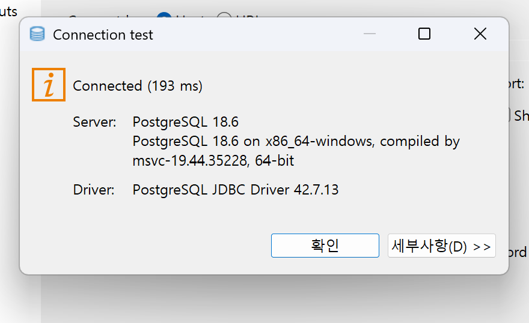
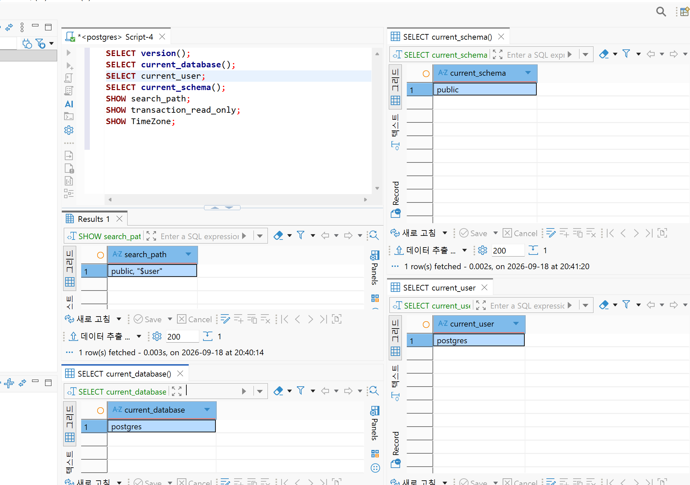
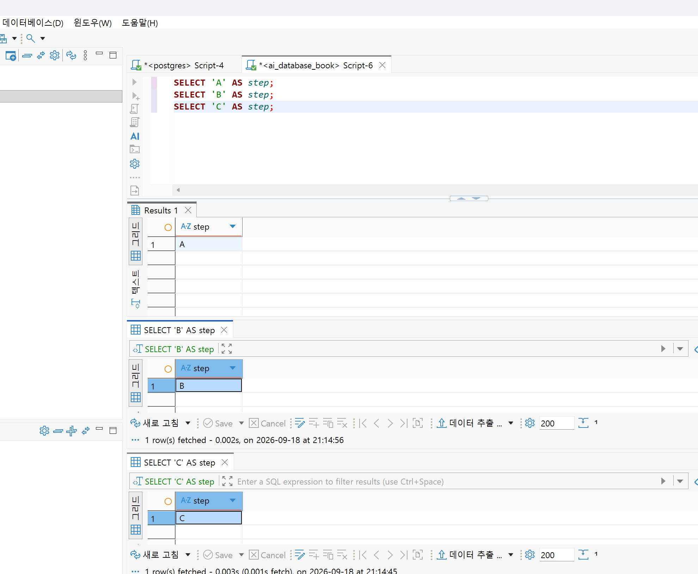

# Chapter 03 확장 실습 답안 템플릿

> **과제:** PostgreSQL과 DBeaver로 실습 환경 검증하기  
> **사용 방법:** 이 파일을 내려받아 본인의 GitHub 저장소에 `chapter03_answer.md`라는 이름으로 저장한 뒤 실습하면서 바로 작성합니다.  
> **제출 방법:** LMS에는 파일을 직접 업로드하지 않고, **본인 GitHub 저장소의 `chapter03_answer.md` 파일 URL**을 제출합니다.

---

## 제출 전 보안 주의

이 과제 파일과 캡처 화면에는 다음 정보를 올리지 않습니다.

```text
실제 PostgreSQL 비밀번호
전체 DB 접속 URL
API Key / Token
개인정보
공개할 필요가 없는 사내 서버 주소
```

LMS에서 제출자를 확인할 수 있으므로 공개 저장소의 답안 파일에 학번이나 실명을 반드시 적을 필요는 없습니다.

```text
GitHub 계정 또는 별칭: 0524youna 
과제 작성일: 20260918   
사용한 AI 도구: chatgpt
```

---

# 1. PostgreSQL과 DBeaver 환경 확인

## 1-1. 내 환경

| 항목 | 작성 내용 |
| --- | --- |
| 운영체제 | window |
| PostgreSQL 버전 | PostgreSQL 18.6 on x86_64-windows, compiled by msvc-19.44.35228, 64-bit |
| DBeaver 버전 | DBeaver 26.2.0 |
| Host | localhost |
| Port | 5432 |
| Database | postgres |
| Username | postgres |

> 비밀번호는 기록하지 않습니다.

## 1-2. PostgreSQL과 DBeaver 역할 설명

```text
PostgreSQL은: 실제로 데이터를 저장하고 관리하는 DBMS.

DBeaver는: 그 서버에 접속해서 SQL을 편하게 날려볼 수 있게 해주는 클라이언트 툴

두 프로그램의 차이는: PostgreSQL은 데이터가 진짜로 저장되는 곳. DBeaver는 그걸 보고 다루기 위한 도구
```

---

# 2. 연결 테스트와 첫 SQL

## 2-1. DBeaver 연결 결과

- [o] PostgreSQL 연결 유형 선택
- [o] Host 확인
- [o] Port 확인
- [o] Database 확인
- [o] Username 확인
- [o] Test Connection 성공

### 연결 성공 화면

권장 이미지 경로:

```text
assignments/chapter03/images/step02_connection.png
```




## 2-2. 첫 SQL 실행

```sql
SELECT 1 + 1 AS result;
```

실행 전 예상:

```text
2
```

실제 결과:

```text
2
```

이 결과가 의미하는 것:

```text
DBeaver에서 작성한 SQL이 실제로 PostgreSQL 서버까지 전달돼서 계산되고, 그 결과가 다시 화면에 돌아왔다는 뜻이다. 즉 연결이 제대로 됐다는 걸 확인한 것이다.
```

---

# 3. 현재 연결 위치를 SQL로 검증

다음 SQL을 실행합니다.

```sql
SELECT version();
SELECT current_database();
SELECT current_user;
SELECT current_schema();
SHOW search_path;
SHOW transaction_read_only;
SHOW TimeZone;
```

## 3-1. 결과 기록

| 확인 항목 | 실제 결과 | 내가 이해한 의미 |
| --- | --- | --- |
| `version()` | PostgreSQL 18.6 on x86_64-windows, compiled by msvc-19.44.35228, 64-bit | 실제 PostgreSQL 서버 버전
운영체제 또는 빌드 정보 일부|
| `current_database()` | postgres | 지금 내가 접속해서 보고 있는 DB |
| `current_user` | postgres | PostgreSQL 세션에서 사용되는 사용자확인|
| `current_schema()` | public |  검색 경로에서 현재 사용할 수 있는 첫 번째 스키마를 알려 줌|
| `search_path` | public, "$user" | 스키마 이름 안 적고 테이블 부르면 이 순서대로 찾아본다는 것? |
| `transaction_read_only` | off | 읽기전용이 아님. (수정 가능?) |
| `TimeZone` | Asia/Seoul | 한국 시간 기준 |

## 3-2. 반드시 설명할 것

### DBeaver 연결 이름과 `current_database()`는 왜 같은 개념이 아닌가요?

```text
DBeaver 연결 이름은 붙인 별명. 실제로 어떤 DB를 보고 있는지는 current_database()를 찍어봐야함. 
```

### `current_schema()`와 `search_path`는 어떤 관계가 있나요?

```text
search_path는 스키마를 안 적었을 때 어디서부터 찾을지 순서를 정해놓은 목록. current_schema()는 목록 중에서 지금 맨 앞에서 쓰이고 있는 스키마 하나를 보여줌.
```

### `transaction_read_only = off`라는 결과만으로 모든 테이블을 만들 권한이 있다고 단정할 수 있나요?

```text
아니다. off는 그냥 지금 트랜잭션이 읽기 전용으로 막혀있지 않다는 뜻일 뿐. create 권한 여부에 따라 다름.
```

## 3-3. 증거 화면

권장 경로:

```text
assignments/chapter03/images/step03_location_check.png
```



---

# 4. `ai_database_book` 데이터베이스 확인

## 4-1. 현재 데이터베이스

```sql
SELECT current_database();
```

실제 결과:

```text
postgres
```

- [x] 결과가 `ai_database_book`이다.
- [d] 다른 DB라면 올바른 연결로 전환했다.

## 4-2. 연결을 바꾼 뒤 다시 검증

```text
전환 전 데이터베이스:postgres
전환 후 데이터베이스:ai_database_book
전환 여부를 판단한 근거: current_database() 실행해서 확인. 
```

### 화면에서 보이는 연결 이름만 믿지 않고 SQL을 다시 실행해야 하는 이유

```text
DBeaver에 보이는 연결 이름이나 탭 이름은 내가 붙인 라벨일 뿐.  진짜로 전환됐는지는 current_database()를 직접 실행해서 서버한테 물어봐야.
```

---

# 5. SQL 실행 범위 실험

SQL Editor에 다음 세 문장을 입력합니다.

```sql
SELECT 'A' AS step;
SELECT 'B' AS step;
SELECT 'C' AS step;
```

## 5-1. 한 문장 실행

```text
내가 실행한 문장:SELECT 'A' AS step;

실제 결과: A
```

## 5-2. 선택 영역 실행

```text
선택한 문장:SELECT 'A' AS step;
SELECT 'B' AS step;
실제 결과:다른 탭으로 a와 b가 따로 뜸 
```

## 5-3. 전체 스크립트 실행

```text
실제 결과: 선택 영역 실행처럼 다 따로 튼다. 
결과 탭 또는 실행 순서에서 관찰한 점: 나열된 순서대로 값이 다 다른 탭에 뜨게 된다 . 
```

## 5-4. 결과 해석

```text
한 문장 실행과 전체 스크립트 실행의 차이:
한 문장은2 하나만 실행됨. 전체 스크립트는 위에서부터 순서대로 다 실행되고 결과 탭도 따로따로 생김.

변경 SQL에서 실행 범위를 잘못 선택하면 위험한 이유:
되돌릴 수 없는 변경이 의도치 않게 여러 개 나갈 수 있어서 위험함.
```

### 증거 화면

권장 경로:

```text
assignments/chapter03/images/step05_execution_scope.png
```



---

# 6. 제공된 환경 확인 SQL 실행

Public 저장소의 Chapter 03 파일을 사용합니다.

```text
code/chapter03/setup_check.sql
code/chapter03/setup_validate_local.sql
```

## 6-1. `setup_check.sql`

실행 결과에서 확인한 항목:

```text
PostgreSQL 버전:PostgreSQL 18.6 on x86_64-windows, compiled by msvc-19.44.35228, 64-bit
현재 DB:ai_database_book   
현재 사용자: postgres
현재 스키마: public
search_path:public, "$user"
읽기 전용 여부: off
TimeZone: Asia/Seoul
1 + 1 결과: 2
public 스키마 존재 여부: v
public USAGE 권한: v
public CREATE 권한: v
```

### 이 파일을 여러 번 실행해도 비교적 안전한 이유

```text
데이터를 변경하지 않는 조회문만 포함함. 
```

## 6-2. `setup_validate_local.sql`

```text
실행 결과:
PASS / FAIL: Pass
```

실패했다면 실패 항목:

```text

```

그 실패가 실제 문제인지 환경 차이인지 판단한 근거:

```text

```

---

# 7. 안전한 오류 진단 실습

실제 오류가 있었다면 그 오류를 사용합니다. 오류가 없었다면 **데이터를 삭제하거나 서버를 강제로 중지하지 말고**, 안전한 SQL 문법 오류를 하나 만들어 관찰합니다.

예:

```sql
SELEC 1;
```

> 오류를 확인한 뒤 올바른 `SELECT 1;`로 복구합니다.

## 7-1. 오류 기록

```text
오류 메시지 핵심 문장: 구문 오류, "SELEC" 부근
  위치: 1

내가 먼저 생각한 원인 1: 문법 오류 

내가 먼저 생각한 원인 2: 

실제로 확인한 방법: SELEC 1; 실행 후 오류 메시지 확인, SELECT로 재실행 비교

실제 원인: SELECT 철자를 잘못 입력함 (SELEC)

수정한 내용:SELEC 1; → SELECT 1; 로 수정 후 정상 실행 확인
```

## 7-2. 수정 후 재검증

```sql
SELECT 1;
SELECT current_database();
```

```text
재검증 결과: 1, ai_database_book
```

## 7-3. 오류를 유형으로 분류

- [ ] 서버 실행 문제
- [ ] Host 문제
- [ ] Port 문제
- [ ] Database 문제
- [ ] Username/인증 문제
- [v] SQL 문법 문제
- [ ] 권한 문제
- [ ] 기타

선택 이유:

```text
오류 메시지가 <구문 오류, SELEC 부근> 그 외 요인과는 무관. 철자오류. 연결 자체는 정상이었고(current database 확인) 문장을 SELECT로 고치자마자 바로 정상 실행됐기 떄문. 
```

---

# 8. AI를 오류 분석 보조 도구로 사용

## 8-1. AI에게 전달한 프롬프트

비밀번호·개인정보·전체 접속 URL은 제거하고 기록합니다.

```text

나는 PostgreSQL과 DBeaver를 처음 배우는 학생입니다.

아래 오류를 바로 하나의 원인으로 단정하지 말고,

초보자가 안전하게 확인할 순서대로 분석해 주세요.

다음 형식으로 설명해 주세요.

1. 오류 메시지에서 확인되는 사실

2. 가능한 원인 후보

3. 각 원인을 확인하는 안전한 방법

4. 확인 결과에 따라 다음에 할 행동

5. 실행하면 위험할 수 있어 피해야 할 명령

실제 비밀번호나 개인정보는 포함하지 않았습니다.

오류 메시지 : 구문 오류, "SELEC" 부근
  위치: 1
```

## 8-2. AI 답변 검토

| AI가 제안한 확인 방법 | 실제로 확인했는가? | 결과 | 수용 / 수정 / 거절 |
| --- | --- | --- | --- |
| SELEC랑 SELECT 철자 비교 | O | 진짜 오타임 | 수용 |
| 세미콜론·따옴표 짝 확인 | O | 이상 없음 | 수용(그냥 참고만) |
| Host/Port/Database 재확인 | O | 연결은 원래 정상| 거절 |

### AI가 오류 원인을 너무 빨리 단정한 부분이 있었나요?

```text
개인적으로 맥락, 사전정보가 부족하고 오류 메시지만 있는데 바로 단정한 것. 
```

### 오류 메시지와 실제 환경 중 무엇을 확인해서 최종 판단했나요?

```text
메시지에 SELEC 부근이라고 이미 나와있긴 했지만 직접 SELEC로 재현하고 SELECT로 고쳐서 되는지 실제로 돌려보고 판단함.
```

### AI 활용에서 가장 유용했던 점

```text
AI가 확인 순서를 짜줌. 사실→후보→확인법→다음행동→위험명령 순
```

### AI 답변을 그대로 실행하지 않고 확인해야 하는 이유

```text
AI는 텍스트만 보고 찍는 거라  실제 DB 상태는 모름. 검증 없이 그대로 실행하면 엉뚱한 게 바뀔 수도 있어서 직접 재현하고 확인해야 함.
```

---

# 9. Chapter 01~02 개인 서비스와 연결

앞에서 선택한 개인 서비스가 PostgreSQL을 사용한다고 가정합니다.

```text
서비스 이름: 도서 대여 관리 서비스

사용할 데이터베이스 이름 후보: library_rental

사용할 스키마 이름 후보: rental

앞으로 만들고 싶은 테이블 후보 3개:
1. members
2. books
3. rentals
```

### 아직 SQL을 만들지 않고 이름과 역할만 정하는 이유

```text
아직 정책이 다 안 정해졌으니까 먼저 이름이랑 역할부터 잡았음.
```

### Chapter 02에서 정리했던 한 행의 의미 중 수정할 부분이 있나요?

```text
딱히 없음. 
```

---

# 10. 초보자용 연결 가이드 작성

친구가 자신의 PC에서 같은 실습을 시작한다고 가정합니다. 아래 순서를 자신의 말로 작성합니다.

```text
1. PostgreSQL 서버가 실행되는지 확인하는 방법:
서비스 실행 중인지 확인하거나 DBeaver로 Test Connection 눌러보면 됨.

2. DBeaver에서 PostgreSQL 연결을 만드는 방법:
새 연결에서 PostgreSQL 선택하고 Host/Port/Database/Username/비밀번호 입력한 다음 Test Connection.

3. Host / Port / Database / Username의 의미:
Host는 서버 위치, Port는 통로 번호, Database는 접속할 DB, Username은 로그인할 계정.

4. ai_database_book에 연결되었는지 확인하는 방법:
연결 이름 말고 current_database(); 직접 실행해서 나오는 값으로 확인.

5. 현재 위치를 확인하는 SQL:
current_database(), current_user, current_schema(), search_path 찍어보면 됨.

6. 한 문장과 전체 스크립트 실행을 구분해야 하는 이유:
전체로 돌리면 의도치 않은 문장까지 같이 나가서 위험할 수 있으니까.

7. 비밀번호를 GitHub나 AI 프롬프트에 넣으면 안 되는 이유:
공개되면 남이 내 DB에 바로 접속할 수 있게 되니까.
```

---

# 11. 최종 성찰

아래 문장은 반드시 본인의 말로 작성합니다.

```text
1. DBeaver와 PostgreSQL의 가장 중요한 차이는
   DBeaver는 도구고 PostgreSQL은 데이터가 진짜 저장되는 곳이라는 것 이다.

2. 내가 지금 어느 데이터베이스에 연결되어 있는지 확인할 때
   화면 이름만 보지 않고 current_database() 직접 실행해서 값을 확인 해야 한다.

3. PostgreSQL 오류가 발생했을 때 가장 먼저 해야 할 일은
   오류 메시지 그대로 읽고 뭘 지적하는지 확인하는 것 이다.

4. AI를 오류 해결에 사용할 때 가장 중요한 것은
   AI 답변 그대로 믿지 말고 직접 재현해서 검증하는 것 이다.
```

---

# 12. 제출 체크리스트

- [ ] `chapter03_answer.md`의 빈 필수 항목을 작성했다.
- [ ] PostgreSQL과 DBeaver의 역할 차이를 설명했다.
- [ ] `current_database/current_user/current_schema/search_path`를 실제로 확인했다.
- [ ] `ai_database_book` 연결 여부를 SQL로 검증했다.
- [ ] SQL 실행 범위 세 가지를 비교했다.
- [ ] `setup_check.sql`을 실행했다.
- [ ] `setup_validate_local.sql` 결과를 확인했다.
- [ ] 오류 원인을 먼저 스스로 추정한 뒤 AI를 사용했다.
- [ ] AI 제안을 실제 환경에서 검증했다.
- [ ] 핵심 캡처 3~4장만 골라 넣었다.
- [ ] 캡처에 비밀번호·개인정보·전체 접속 URL이 없다.
- [ ] Markdown 이미지가 GitHub 웹 화면에서 실제로 보인다.
- [ ] 최종 답안 파일을 commit/push했다.

---

# 13. LMS 제출 URL

아래 형식의 **본인 GitHub 파일 URL**을 LMS에 제출합니다.

```text
https://github.com/<본인-GitHub-ID>/<본인-저장소>/blob/main/assignments/chapter03/chapter03_answer.md
```

내 제출 URL:

```text

```

> 저장소 메인 URL, 교수자 템플릿 URL, Raw URL이 아니라 **작성 완료된 본인 `chapter03_answer.md` 파일 화면 URL**을 제출합니다.
