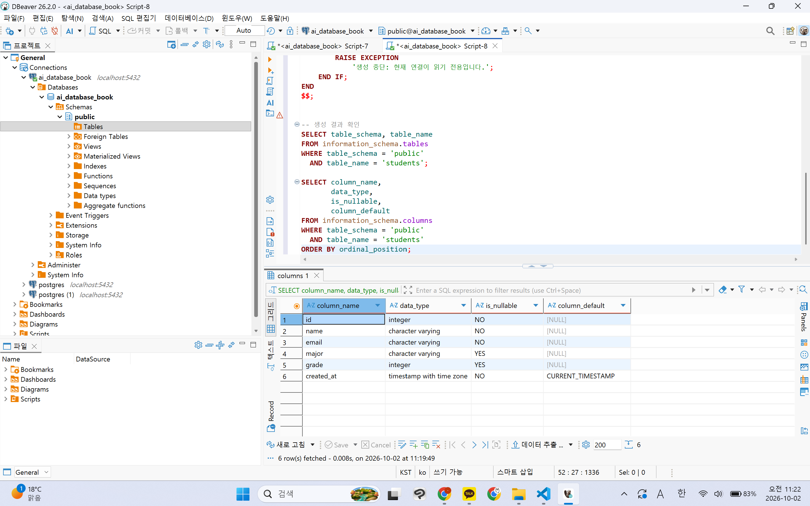
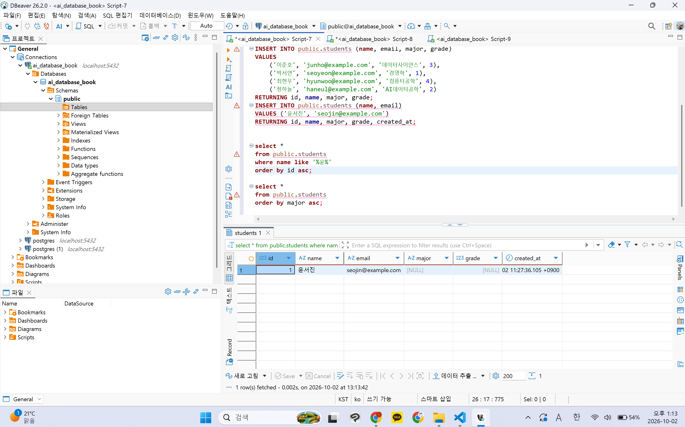
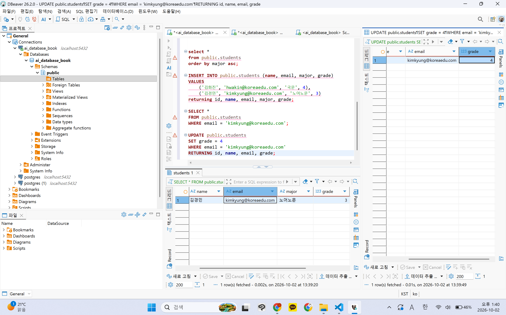
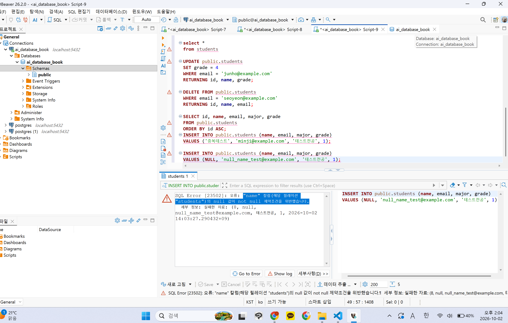

# Chapter 04 확장 실습 답안 템플릿

> **과제:** 관계형 데이터베이스와 SQL 시작하기  
> **사용 방법:** 이 파일을 내려받아 본인의 GitHub 저장소에 `chapter04_answer.md`라는 이름으로 저장한 뒤 실습하면서 바로 작성합니다.  
> **제출 방법:** LMS에는 파일을 직접 업로드하지 않고, **본인 GitHub 저장소의 `chapter04_answer.md` 파일 URL**을 제출합니다.

---

## 제출 전 주의

이 파일과 캡처 화면에는 실제 비밀번호, 전체 DB 접속 URL, API Key, 개인정보를 기록하지 않습니다.

```text
GitHub 계정 또는 별칭: 0524youna
과제 작성일: 2026-10-02
사용한 AI 도구: ChatGPT
```

---

# 1. 실습 환경과 시작 상태 확인

다음을 실행합니다.

```sql
SELECT current_database();
SELECT current_user;
SELECT current_schema();
SHOW search_path;
SHOW transaction_read_only;
```

| 확인 항목 | 실제 결과 | 의미 |
| --- | --- | --- |
| `current_database()` | `ai_database_book` | 지금 접속한 DB |
| `current_user` | `postgres` | postgres 계정으로 접속 중임 |
| `current_schema()` | `public` | 스키마 생략 시 public에 테이블이 만들어짐 |
| `search_path` | `public, "$user"` | 테이블 이름만 쓰면 public부터 찾음 |
| `transaction_read_only` | `off` | 읽기 전용이 아니라 CRUD 실행 가능 |

- [x] 현재 DB가 `ai_database_book`이다.
- [x] 변경 가능한 연결인지 확인했다.
- [x] 실행할 SQL 범위를 확인했다.
- [x] Auto-commit 상태를 확인했다.

### 변경 SQL을 실행하기 전에 현재 DB와 실행 범위를 확인해야 하는 이유

```text
엉뚱한 DB나 스키마에서 실행하면 다른 데이터가 바뀌거나 지워질 수 있음.
Auto-commit 상태에서는 실행 즉시 반영되어 되돌리기 어려우므로, 대상 DB와 실행할 SQL 범위를 먼저 확인해야 함.
```

---

# 2. `public.students` 구조 생성

## 2-1. 실행 전 예상

```text
테이블 이름: students
한 행의 의미: 학생 한 명의 정보(이름, 이메일, 전공, 학년 등)
예상 행 수: 0 (구조만 만들고 데이터는 아직 없음)
기본키: id
필수 열: id, name, email, created_at (NOT NULL)
중복을 막는 열: email (UNIQUE)
자동 생성 열: id (IDENTITY), created_at (DEFAULT CURRENT_TIMESTAMP)
```

## 2-2. 실행 파일

```text
code/chapter04/01_create_students.sql
```

## 2-3. 실행 후 확인

```text
테이블 생성 성공 여부: 성공
실제 행 수: 0
DBeaver에서 확인한 위치: ai_database_book > Schemas > public > Tables > students
```

### 각 열의 역할

| 열 | 타입 | NULL 가능? | 역할 |
| --- | --- | --- | --- |
| `id` | `INTEGER` (IDENTITY) | 불가 | 기본키, 행마다 자동 부여되는 식별 번호 |
| `name` | `VARCHAR(50)` | 불가 | 학생 이름 |
| `email` | `VARCHAR(100)` | 불가 | 학생 이메일, `UNIQUE`로 중복 불가 |
| `major` | `VARCHAR(100)` | 가능 | 전공, 모르면 비워둘 수 있음 |
| `grade` | `INTEGER` | 가능 | 학년, 모르면 비워둘 수 있음 |
| `created_at` | `TIMESTAMPTZ` | 불가 | 행 생성 시각, 값 안 넣으면 현재 시각 자동 입력 |

### `id`를 학번이나 학생 수로 해석하면 안 되는 이유

```text
id는 DB가 행 구분용으로 자동 부여하는 번호일 뿐 실제 학번과 무관함.
삭제·INSERT 실패 등으로 번호가 건너뛸 수 있어 마지막 id 값이 학생 수와 같다는 보장이 없음. 학생 수는 COUNT(*)로 확인해야 함.
```

### 증거 화면

권장 경로:

```text
assignments/chapter04/images/step02_table.png
```



---

# 3. 샘플 데이터 6명 입력

## 3-1. 실행 전 예상

```text
현재 행 수: 0
실행 후 예상 행 수: 6
예상되는 NULL 포함 학생:윤서진
```

## 3-2. 실행 파일

```text
code/chapter04/02_insert_students.sql
```

## 3-3. 실제 결과

```text
실제 행 수: 6
이준호 grade:3
박서연 존재 여부: O
윤서진 major: NULL
윤서진 grade: NULL
```

### 예상과 실제 비교

```text
예상과 실제가 일치했는가: 일치하다.
다르다면 이유: x
```

### `created_at` 값이 여러 행에서 같을 수 있는 이유

```text
6명을 하나의 INSERT 문으로 함께 입력하면 같은 트랜잭션 안에서 처리된다.
PostgreSQL의 CURRENT_TIMESTAMP(now())는 트랜잭션이 시작된 시각을 돌려주므로, 같은 트랜잭션에서 들어간 행들은 created_at 값이 모두 같게 찍힌다.
```

---

# 4. SELECT 복습과 결과 검증

각 문제는 **SQL 실행 전에 예상 행 수를 먼저 작성**합니다.

| 번호 | 조회 문제 | 예상 행 수 | 실제 행 수 | 일치? | 다르면 이유 |
| ---: | --- | ---: | ---: | --- | --- |
| 1 | 전체 학생 | 6| 6 | 일치 | |
| 2 | 이름·이메일만 조회 | 6 | 6 | 일치 |  |
| 3 | 특정 전공 - 컴퓨터 공학| 2 | 2 | 일치 |  |
| 4 | 특정 학년 이상 - 3학년이상 | 2 | 2 | 일치 |  |
| 5 | 두 전공 중 하나 -컴퓨터 공학, 데이터 사이언스 | 3 |3  | 일치 |  |
| 6 | `grade IS NULL` | 1 | 1 | 일치|  |
| 7 | 전공 `DISTINCT` | 4 |4  |일치  |  |
| 8 | 정렬 후 상위 3명 | 3 | 3 | 일치 |  |

## 4-1. 내가 직접 작성한 SQL 2개

```sql
-- SQL 1

select *
from public.students
where name like '%윤%' 
order by id asc;
```

```text
이 SQL의 한 행 의미: 이름에 '윤'자가 들어가는 학생
예상 행 수: 1
실제 행 수: 1
```

```sql
-- SQL 2
select *
from public.students
order by major asc;
```

```text
이 SQL의 한 행 의미: 전공 기준으로 학생을 오름차순으로 정리한 목록
예상 행 수:6
실제 행 수:6
```

## 4-2. `= NULL` 대신 `IS NULL`을 사용하는 이유
NULL은 값이 아니라 알 수 없음 상태를 뜻하기 때문에 = NULL로 비교하면 결과가 참이 아니라 UNKNOWN이 되어 아무 행도 조회되지 않는다.
그래서 NULL인지 확인할 때는 IS NULL을 사용해야 한다.


## 4-3. `ORDER BY` 없이 결과 순서를 믿으면 안 되는 이유
관계형 데이터베이스의 테이블에는 정해진 행 순서가 없다. ORDER BY가 없으면 DB는 그때그때 편한 순서로 결과를 돌려준다.
원하는 순서가 있다면 반드시 ORDER BY로 지정해야 한다.

```text

```

## 4-4. `DISTINCT`가 원본 데이터를 삭제하는 기능인가요?

```text
조회결과의 중복을 제거하기 때문에 원본은 수정하지 않음. 
```

### 증거 화면

권장 경로:

```text
assignments/chapter04/images/step04_select.png
```



---

# 5. 내 가상 학생 2명 추가

실명·실제 이메일 대신 가상 데이터를 사용합니다.

## 5-1. 실행 전 계획

```text
학생 A
이름:김화진
이메일:hwakin@koreaedu.com
전공:국문
학년:4

학생 B
이름: 김경민
이메일:kimkyung@koreaedu.com
전공: 노어노문
학년 또는 NULL: 3

현재 행 수:6
추가 후 예상 행 수:8
```

## 5-2. 내가 실행한 INSERT

```sql
INSERT INTO public.students (name, email, major, grade)
VALUES
    ('김화진', 'hwakin@koreaedu.com', '국문', 4),
    ('김경민', 'kimkyung@koreaedu.com', '노어노문', 3)
returning id, name, email, major, grade;
```

## 5-3. 실제 결과

```text
RETURNING 또는 확인 SELECT 결과:id	9	김화진	hwakin@koreaedu.com	국문	4	2026-10-02 13:32:27.821 +0900
10	김경민	kimkyung@koreaedu.com	노어노문	3	2026-10-02 13:32:27.821 +0900
실제 전체 행 수: 8
예상과 일치 여부: 행 수(8)는 일치. 다만 id는 예상한 7,8이 아니라 9,10이 부여됨.
id가 건너뛴 이유: 앞서 실패했거나 다시 실행한 INSERT에서 이미 사용된 IDENTITY 번호는 되돌아가지 않기 때문. id는 행 구분용 번호라 문제 아님.
```

### 내가 일부 값을 NULL로 둔 이유 또는 NULL을 사용하지 않은 이유

```text
두 학생 모두 전공과 학년을 정해 둔 가상 데이터라 값을 알고 있었기 때문에 NULL을 사용하지 않았다.

```

---

# 6. 안전한 UPDATE

내가 추가한 가상 학생 한 명만 수정합니다.

## 6-1. 먼저 대상 확인 SELECT

```sql
SELECT *
FROM public.students
WHERE email = 'kimkyung@koreaedu.com';
```

```text
예상 대상 행 수:1
실제 대상 행 수:1
```

## 6-2. UPDATE

```sql
UPDATE public.students
SET grade = 4
WHERE email = 'kimkyung@koreaedu.com'
RETURNING id, name, email, grade;
```

```text
예상 영향 행 수:1
실제 영향 행 수:1
RETURNING 결과:10	김경민	kimkyung@koreaedu.com	4
```

## 6-3. UPDATE 후 재조회

```sql
SELECT *
FROM public.students
WHERE email = 'kimkyung@koreaedu.com';
```

### `WHERE` 없는 UPDATE를 실행하면 위험한 이유

```text
Where이 없으면 모든 학생을 변경할 수도 있어 위험함. 
```

### 증거 화면

권장 경로:

```text
assignments/chapter04/images/step06_update.png
```



---

# 7. 안전한 DELETE

내가 추가한 가상 학생 한 명을 삭제합니다.

## 7-1. 삭제 전 확인

```sql
SELECT *
FROM public.students
WHERE email = 'kimkyung@koreaedu.com';
```

```text
예상 대상 행 수:1
실제 대상 행 수:1
```

## 7-2. DELETE

```sql
DELETE FROM public.students
WHERE email = 'kimkyung@koreaedu.com'
RETURNING id, name, email;

```

```text
예상 영향 행 수:1
실제 영향 행 수:1
RETURNING 결과:10	김경민	kimkyung@koreaedu.com 
```

## 7-3. 삭제 후 재조회

```sql
SELECT *
FROM public.students
WHERE email = 'kimkyung@koreaedu.com';
 
```

```text
삭제 후 같은 조건의 SELECT 결과 행 수:0
```

### `DELETE` 성공 메시지만 보고 끝내지 않고 다시 SELECT해야 하는 이유

```text
성공 메시지는 SQL 문장이 오류 없이 실행되었다는 뜻일 뿐, 의도한 행이 정확히 삭제되었다는 보장은 아니다.
조건이 틀리면 0행이 삭제되어도 성공으로 표시되므로 다시 SELECT해서 대상 행이 실제로 사라졌는지 확인해야 한다.

```

---

# 8. 본문 기준 UPDATE·DELETE 상태 검증

`04_update_delete_students.sql`을 본문 시작 상태에서 실행했다면 다음을 확인합니다.

```text
최종 학생 수:5
이준호 grade:4
박서연 존재 여부: x
```

본문 기준 기대 상태와 비교합니다.

```text
학생 수 = 5
이준호 grade = 4
박서연 = 0행
```

### 내 실제 결과가 기준과 다르다면 원인

```text
기준과 결과가 같다. 
```

---

# 9. 의도한 실패 2개 관찰

> 실패 테스트는 데이터베이스 규칙이 실제로 데이터를 보호하는지 확인하는 실험입니다.

## 9-1. 중복 이메일 `UNIQUE` 오류

내가 사용한 SQL:

```sql
INSERT INTO public.students (name, email, major, grade)
VALUES ('중복테스트', 'minji@example.com', '테스트전공', 1);

```

```text
오류 메시지 핵심 단서:"students_email_key" 고유 제약 조건을 위반함
왜 실패해야 맞는가: email은 unique이기 때문에 중복 입력되면 안됨. 
어떤 규칙이 작동했는가: email 열에 설정된 UNIQUE 제약조건(students_email_key)이 작동했다.
실패 후 기존 데이터가 어떻게 유지되었는가: INSERT가 거부되어 새 행이 추가되지 않았고, 기존 데이터는 그대로 유지되었다.

```

## 9-2. 이름 `NULL` 입력 `NOT NULL` 오류

내가 사용한 SQL:

```sql

INSERT INTO public.students (name, email, major, grade)

VALUES (NULL, 'null_name_test@example.com', '테스트전공', 1);
```

```text
오류 메시지 핵심 단서: name칼럼의 null 값이 not null 제약조건을 위반함
왜 실패해야 맞는가: name 열은 NOT NULL로 정의되어 있어 이름 없는 학생은 저장할 수 없다.
어떤 규칙이 작동했는가: name 열의 NOT NULL 제약조건이 작동했다.

```

### 실패한 INSERT 뒤 자동 생성 `id` 번호에 빈 구간이 생길 수 있어도 문제라고 단정할 수 없는 이유

```text

id는 행을 구분하려고 DB가 자동으로 부여하는 내부 번호일 뿐 학생 수나 학번을 뜻하지 않는다.
INSERT가 실패해도 이미 사용된 번호는 되돌아가지 않으므로 빈 번호가 생길 수 있으며 이는 정상적인 동작이다.


```

### 증거 화면

권장 경로:

```text
assignments/chapter04/images/step09_constraint_error.png
```



---

# 10. `verify_students.sql`로 최종 상태 확인

실행 파일:

```text
code/chapter04/verify_students.sql
```

```text
현재 전체 학생 수:5
NULL 개수:major/grade 각각 1
이준호 grade:4
박서연 존재 여부:x
현재 데이터 상태에서 예상과 다른 부분:x
```

### 검증 SQL을 따로 두면 좋은 이유

```text
SQL이 성공적으로 실행되었다는 것은 DB가 문장을 처리했다는 뜻일 뿐이고, 결과가 기대한 상태와 같다는 뜻은 아니다.
검증 SQL을 따로 두면 최종 구조와 데이터가 기대 상태와 맞는지 언제든 같은 기준으로 반복해서 확인할 수 있다.


```

---

# 11. AI를 SQL 작성자가 아니라 검토자로 활용

먼저 본인이 SQL을 작성한 뒤 AI에게 검토를 요청합니다.

## 11-1. 내가 작성한 SQL

```sql
UPDATE students
SET major = '컴퓨터공학',
    grade = 1
WHERE id = 6;
```

## 11-2. AI에게 전달한 핵심 요청

```text
나는 PostgreSQL 초보자입니다.
아래 SQL을 바로 다시 작성하지 말고 먼저 안전성을 검토해 주세요.
다음 순서로 답해 주세요.
1. 이 SQL이 영향을 줄 것으로 예상되는 행
2. WHERE 조건이 너무 넓거나 모호하지 않은지
3. NULL 처리에서 주의할 점
4. 실행 전에 같은 조건으로 확인할 SELECT
5. 실행 후 결과를 확인할 SELECT
6. 내가 놓친 위험이 있다면 질문 형태로 제시
```

## 11-3. AI 검토 결과

| AI 제안 | 수용 / 수정 / 거절 | 실제 검증 결과 | 나의 이유 |
| --- | --- | --- | --- |
| 실행 전 `SELECT id, name, major, grade FROM students WHERE id = 6;`로 대상 확인 | 수용 | 1행 조회됨, 윤서진 major·grade 모두 NULL | 바꿀 대상이 맞는지 먼저 확인해야 함 |
| 실행 후 같은 조건의 SELECT로 결과 확인 | 수용 | major = 컴퓨터공학, grade = 1로 바뀐 것 확인함 | 성공 메시지만으로는 값이 제대로 바뀌었는지 알 수 없음 |
| id에 고유 제약이 없으면 여러 행이 바뀔 수 있음 | 거절 | 테이블 구조에서 id가 PRIMARY KEY임을 확인함 | id는 기본키라 중복될 수 없으므로 이 테이블에는 해당하지 않음 |

### AI가 예상한 영향 행 수와 실제 결과가 같았나요?

```text
같았음. AI는 id = 6인 윤서진 1행을 예상했고 실제 결과도 UPDATE 1.
```

### AI 답변을 실행 전에 검토해야 하는 이유

```text
AI는 실제 DB 구조와 데이터를 직접 보지 않고 추측해서 답함.
틀린 조건이나 상황에 안 맞는 제안이 섞일 수 있으므로 실행 전에 실제 테이블 구조와 SELECT 결과로 직접 확인해야 함.
```

---

# 12. 내 서비스 테이블 하나 확장 설계

Chapter 01~03에서 정한 개인 서비스에서 **테이블 하나**를 선택합니다.

```text
서비스 이름: 도서 대여 관리 서비스
테이블 이름: rentals
한 행의 의미: 회원이 도서를 대여한 사건 한 건
```

| 열 이름 | 저장할 값 | 타입 후보 | NULL 가능? | UNIQUE 후보? | 이유 |
| --- | --- | --- | --- | --- | --- |
| rental_id | 대여 기록 번호 | INTEGER (IDENTITY) | 불가 | O (PK) | 행마다 자동 부여되는 내부 식별자 |
| member_id | 대여한 회원 | INTEGER | 불가 | X | members 참조 FK, 한 회원이 여러 번 대여 가능 |
| book_id | 대여한 도서 | INTEGER | 불가 | X | books 참조 FK, 한 도서가 여러 번 대여될 수 있음 |
| rented_at | 대여 시각 | TIMESTAMPTZ | 불가 | X | 대여 사건엔 항상 시각이 있음, 기본값은 현재 시각 |
| due_date | 반납 기한 | DATE | 불가 | X | 기한 없는 대여는 없다고 봄 |
| returned_at | 실제 반납 시각 | TIMESTAMPTZ | 가능 | X | 아직 반납 안 했으면 NULL |
| status | 대여 상태 | VARCHAR(20) | 불가 | X | 반납 상태를 별도 테이블 대신 rentals에 둠 |

```text
PK 후보: rental_id
업무 식별자 후보: 없음 (대여 기록엔 따로 붙는 업무 번호가 없음)
아직 미확정인 규칙:
- 같은 회원이 같은 도서를 동시에 여러 번 대여할 수 있는지
- 연체를 status 값으로 관리할지 (status에 들어갈 값 목록 미정)
- 한 번의 대여에 여러 권을 담을 수 있는지
- 도서를 제목 단위로 볼지 실제 권수 단위로 볼지
```

## 선택: CREATE TABLE 초안

> 아직 확정되지 않은 업무 규칙은 억지로 제약조건으로 만들지 않습니다.

```sql
CREATE TABLE rental.rentals (
    rental_id   INTEGER GENERATED ALWAYS AS IDENTITY PRIMARY KEY,
    member_id   INTEGER NOT NULL REFERENCES rental.members (member_id),
    book_id     INTEGER NOT NULL REFERENCES rental.books (book_id),
    rented_at   TIMESTAMPTZ NOT NULL DEFAULT now(),
    due_date    DATE NOT NULL,
    returned_at TIMESTAMPTZ,
    status      VARCHAR(20) NOT NULL
);
-- (member_id, book_id) UNIQUE는 동시 대여 정책 미정이라 넣지 않음
-- status CHECK는 연체 관리 여부 미정이라 넣지 않음
```

### AI에게 검토받은 뒤 수정한 부분

```text
- 반납 상태를 별도 테이블로 두지 않고 rentals의 status 열로 합침. 대여 기록에 딸린 정보라 따로 두면 중복될 수 있음.
- book_id는 우선 도서 제목 단위의 books를 참조하게 둠. 여러 권 보유 여부가 아직 미확정임.
- 한 대여에 여러 권 담기, 연체 관리는 AI가 질문만 했고 정책이 미정이라 제약조건으로 만들지 않음.
```

---

# 13. 최종 성찰

아래 문장은 본인의 말로 작성합니다.

```text
1. SQL 실행 성공과 올바른 대상 선택이 다른 이유는
   DB는 문법만 맞으면 WHERE 조건이 틀려도 그대로 실행하고 성공이라고 알려 주기 때문 이다.

2. UPDATE와 DELETE 전에 SELECT를 먼저 해야 하는 이유는
   같은 조건으로 어떤 행이 몇 개 걸리는지 미리 보고, 내가 바꾸려는 행만 정확히 골랐는지 확인하기 위해서 이다.

3. 영향받은 행 수를 확인해야 하는 이유는
   예상한 행 수와 다르면 조건이 너무 넓거나 틀렸다는 신호이므로, 잘못 바뀐 데이터를 바로 알아챌 수 있기 때문 이다.

4. UNIQUE 또는 NOT NULL 오류를 '보호 장치가 정상 동작한 결과'라고 볼 수 있는 이유는
   규칙에 어긋나는 데이터가 들어오지 못하도록 DB가 막아서 기존 데이터가 그대로 지켜졌기 때문 이다.

5. AI가 SQL을 만들어 주더라도 내가 반드시 확인해야 하는 것은
   대상 테이블·WHERE 조건이 맞는지, 실행 전후 SELECT로 영향 행 수와 실제 결과가 예상과 같은지 이다.
```

---

# 14. 제출 체크리스트

- [x] `chapter04_answer.md`를 본인 저장소에 만들었다.
- [x] 현재 DB와 실행 환경을 확인했다.
- [x] `public.students`를 생성했다.
- [x] 샘플 6명 입력 결과를 검증했다.
- [x] SELECT 문제에서 실행 전 예상 행 수를 작성했다.
- [x] 가상 학생 2명을 추가했다.
- [x] UPDATE 전후를 SELECT로 확인했다.
- [x] DELETE 전후를 SELECT로 확인했다.
- [x] UNIQUE 오류를 관찰했다.
- [x] NOT NULL 오류를 관찰했다.
- [x] `verify_students.sql`로 상태를 확인했다.
- [x] AI 제안을 실제 SQL 결과와 비교했다.
- [x] 개인 서비스 테이블 하나를 확장 설계했다.
- [x] 핵심 캡처는 3~4장 정도로 제한했다.
- [x] 비밀번호·개인정보가 캡처에 없다.
- [x] Markdown 이미지가 GitHub 웹 화면에서 정상 표시된다.
- [x] commit/push를 완료했다.

---

# 15. LMS 제출 URL

아래 형식의 **본인 GitHub 파일 URL**을 LMS에 제출합니다.

```text
https://github.com/<본인-GitHub-ID>/<본인-저장소>/blob/main/assignments/chapter04/chapter04_answer.md
```

내 제출 URL:

```text
https://github.com/0524youna-gif/2602database/blob/main/assignments/chapter04/chapter04_answer.md
```

> 교수자 템플릿 URL이나 저장소 메인 URL이 아니라 **작성 완료된 본인 `chapter04_answer.md` 파일 화면 URL**을 제출합니다.
