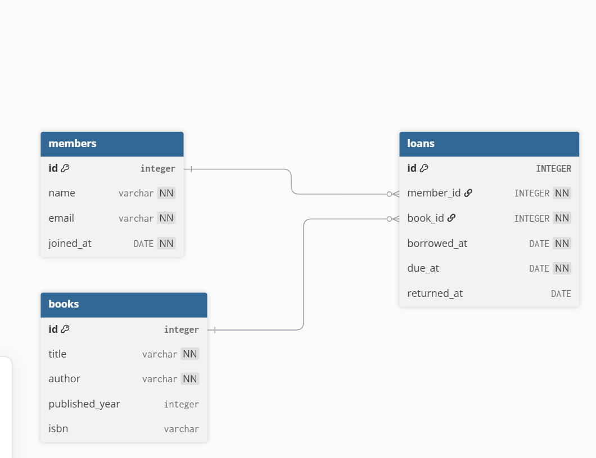
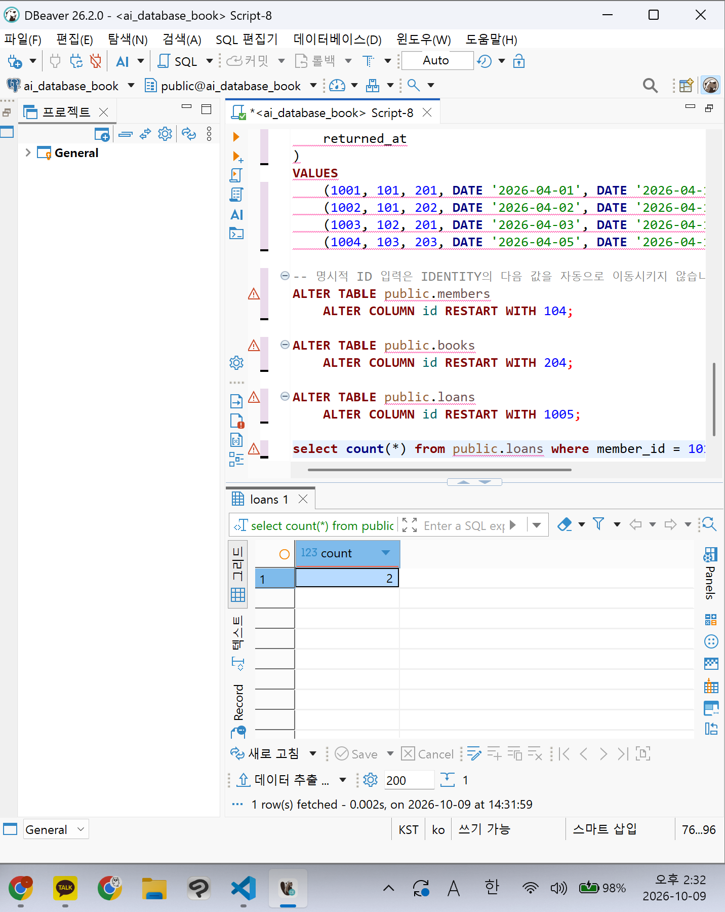
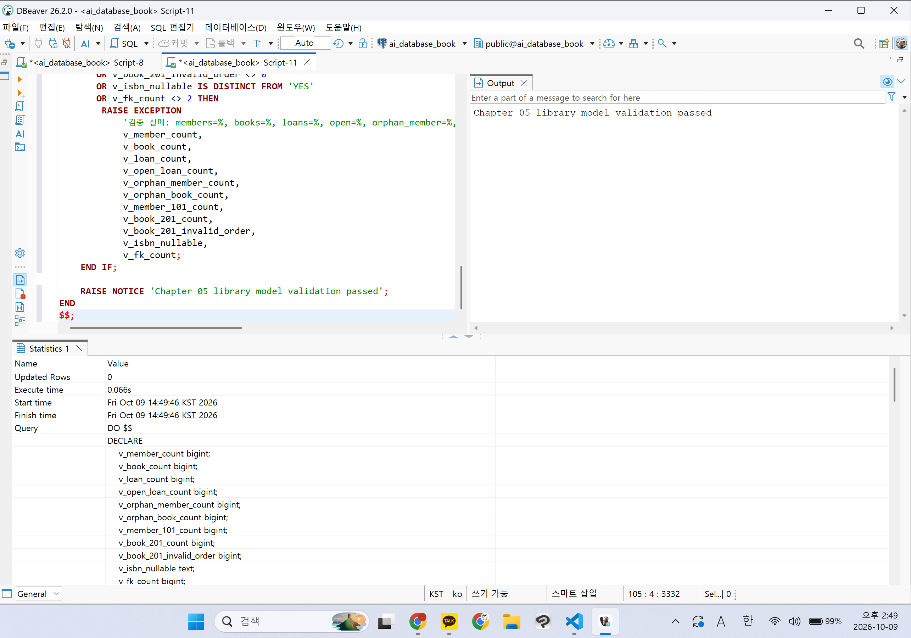
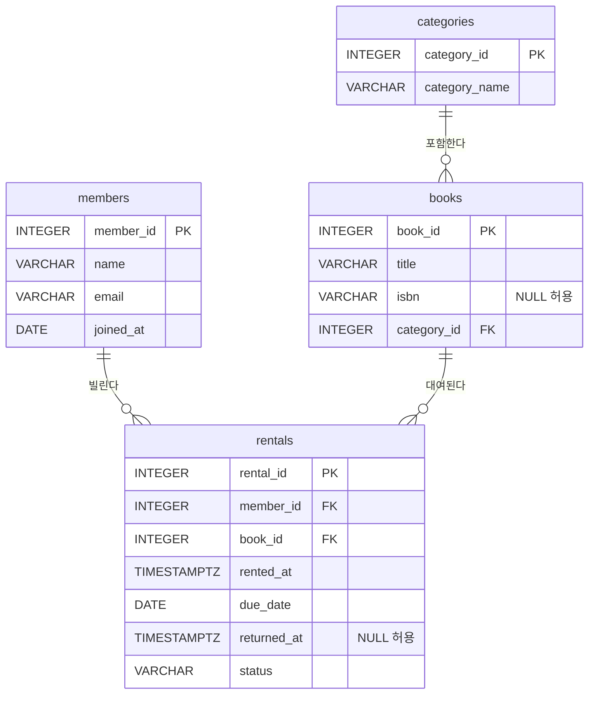

# Chapter 05 확장 실습 답안 템플릿

> **과제:** 요구사항에서 데이터 모델과 ERD 만들기  
> **사용 방법:** 이 파일을 내려받아 본인의 GitHub 저장소에 `chapter05_answer.md`라는 이름으로 저장한 뒤 실습하면서 바로 작성합니다.  
> **제출 방법:** LMS에는 파일을 직접 업로드하지 않고, **본인 GitHub 저장소의 `chapter05_answer.md` 파일 URL**을 제출합니다.

---

## 제출 전 주의

이 파일과 캡처 화면에는 실제 비밀번호, 전체 DB 접속 URL, API Key, 개인정보를 기록하지 않습니다.

```text
GitHub 계정 또는 별칭:0524youna
과제 작성일:2026/10/09
사용한 AI 도구:claude
```

---

# 1. Chapter 05 핵심 개념 복습

본문을 보지 않고 먼저 작성합니다.

```text
요구사항에서 바로 테이블부터 만들면 위험한 이유:
대상, 사건, 속성을 구분하지 못해 테이블을 잘못 나눌 수 있다.

한 행의 의미를 먼저 정해야 하는 이유:
한 행이 무엇인지 정해야 PK와 속성과 관계가 정해진다.

확정 요구사항과 미확정 정책을 구분해야 하는 이유:
없는 정책을 마음대로 제약조건으로 만들면 나중에 바꾸기 어렵다.

PK와 업무상 고유값 후보의 차이:
PK는 행을 식별하는 값. 업무상 고유값(이메일, ISBN)은 정책에 따라 고유하지 않을 수도 있다.

N:M 관계를 그대로 두지 않고 연결 테이블을 검토하는 이유:
N:M은 직접 저장할 수 없고 관계 자체에 날짜 같은 속성이 붙기 때문이다.
```

---

# 2. 도서 대여 요구사항 R-01~R-07 다시 분해

| 요구사항 | 관리 대상 / 사건 | 속성 후보 | 관계 / 규칙 후보 | 미확정 질문 |
| --- | --- | --- | --- | --- |
| R-01 | 회원 | - | 도서관이 회원을 관리한다. | 회원을 삭제하면 대여 이력은 남기는가? |
| R-02 | 회원 | 이름, 이메일, 가입일 | 회원마다 이 세 정보를 가진다. | 이메일은 고유한가? 대소문자는 구분하는가? |
| R-03 | 도서 | 제목, 저자, 출판연도, ISBN | 제목과 저자는 필수이고, 출판연도와 ISBN은 선택이다. | ISBN은 고유한가? ISBN이 없어도 등록할 수 있는가? 저자가 여러 명일 수 있는가? |
| R-04 | 대여 (사건) | - | 한 회원이 여러 권을 빌릴 수 있다. | 한 명이 최대 몇 권까지 빌릴 수 있는가? |
| R-05 | 대여 (사건) | - | 한 책이 시간에 따라 여러 번 대여될 수 있다. | 같은 책을 동시에 두 사람이 빌릴 수 있는가? 같은 ISBN의 책이 여러 권이면 어떻게 구분하는가? |
| R-06 | 대여 기록 | 대여일, 반납예정일, 실제반납일 | 대여 기록은 회원과 도서를 잇는다. | 반납예정일은 어떻게 정하는가? |
| R-07 | 대여 기록 | 실제반납일 | 아직 반납하지 않았으면 실제반납일은 비워 둘 수 있다(NULL). | 연체는 어떻게 처리하는가? |

### 본문과 비교한 뒤 수정한 내용

```text
처음에 놓친 부분:
- R-01에서 도서관이 관리하는 대상에 도서를 빠뜨림. 본문은 회원과 도서를 둘 다 관리한다고 했다.
- 한 회원과 한 도서 사이에 대여 기록이 여러 개 생길 수 있다는 관계를 적지 않았다.

처음에 잘못 분류한 부분:
- R-04와 R-05를 "대여 (사건)"이라고만 적었다. 대여 기록이 회원과 도서를 잇는다는 점을 적지 않았다.
- 수정 후 R-01: 관리 대상 = 회원, 도서
- 수정 후 R-04: 관리 대상 = 대여 기록. 규칙 = 대여 기록은 회원과 도서를 잇는다.
- 수정 후 R-05: 규칙 = 한 회원과 한 도서는 시간에 따라 대여 기록을 여러 개 가질 수 있다.
- 수정 후 R-02: 규칙 = 이메일에 UNIQUE를 걸지 않는다(미확정이므로).
- 수정 후 R-03: 규칙 = ISBN은 NULL을 허용하고, UNIQUE를 걸지 않는다.

수정한 이유:
- R-01: 본문은 회원과 도서를 둘 다 관리 대상으로 본다.
- R-04, R-05: 대여는 따로 저장해야 하는 기록이고 회원과 도서를 연결함.
- R-05: 같은 회원이 같은 책을 여러 번 빌릴 수 있음.
- R-02, R-03: 요구사항에 고유하다는 말이 없다. 미확정으로 남겼다
```

---

# 3. 확정 규칙과 미확정 정책 구분

## 3-1. 확정된 규칙

```text
1. 도서관은 회원과 도서를 관리한다.
2. 대여 기록은 회원과 도서를 연결한다.
3. 대여 기록은 대여일과 반납예정일을 저장한다.
4. 아직 반납하지 않은 대여는 실제반납일이 비어 있을 수 있다.
5. 한 회원과 한 도서는 시간에 따라 대여 기록을 여러 개 가질 수 있다.
```

## 3-2. 미확정 질문

최소 5개를 작성합니다.

```text
Q1. 회원 이메일은 반드시 고유한가? 대소문자는 같은 것으로 보는가?
Q2. ISBN은 반드시 고유한가? ISBN 없이도 도서를 등록할 수 있는가?
Q3. 한 도서에 저자가 여러 명일 수 있는가?
Q4. 같은 ISBN의 실물 책이 여러 권이면 어떻게 구분하는가?
Q5. 회원 한 명이 최대 몇 권까지 빌릴 수 있는가?

```

### 미확정 정책을 바로 `UNIQUE`, `CHECK`, 삭제 규칙으로 구현하면 위험한 이유

```text
요구사항에 없는 규칙을 설계자가 임의로 확정하게됨. 
예를 들어 ISBN에 UNIQUE를 걸면 같은 ISBN의 복본을 등록할 수 없다.
나중에 제약조건을 바꾸면 이미 저장된 데이터와 충돌할 수 있다.
```

---

# 4. 엔터티·속성·사건 후보 구분

| 후보 | 대상 엔터티 / 사건 엔터티 / 속성 | 판단 근거 | 독립 식별 필요? |
| --- | --- | --- | --- |
| 회원 | 대상 엔터티 | 도서관이 계속 관리하는 사람. 이름, 이메일, 가입일 같은 자기 속성을 가진다| 필요. 이름이나 이메일이 같은 회원이 있을 수 있으므로 회원 ID가 필요하다. |
| 도서 | 대상 엔터티 | 도서관이 계속 관리하는 물건. 제목, 저자, 출판연도, ISBN을 가진다| 필요. ISBN은 없거나 중복될 수 있으므로 도서 ID가 필요하다. |
| 대여 기록 | 사건 엔터티 | 회원이 도서를 빌린 일이 특정 시점에 일어난다. 같은 회원과 도서 사이에서도 여러 번 생기고, 대여일·반납예정일·실제반납일을 가진다| 필요. 회원 ID + 도서 ID만으로는 같은 책을 다시 빌린 기록을 구분할 수 없으므로 대여 ID가 필요하다. |
| 이메일 | 속성 (회원) | 회원 한 명을 설명하는 값이다. 혼자서는 따로 관리할 대상이 아님.| 불필요. 회원 행 안에 저장한다. |
| ISBN | 속성 (도서) | 도서 한 건을 설명하는 값이다. | 불필요. 도서 행 안에 저장한다. 고유한지는 미확정이다. |
| 반납예정일 | 속성 (대여 기록) | 같은 책이라도 대여할 때마다 날짜가 다르다(R-06). | 불필요. 대여 기록 행 안에 저장한다. |


### “명사가 보이면 무조건 테이블”이 아닌 이유

```text
엔터티와 특성을 구분해야 한다.
이메일, ISBN, 반납예정일도 명사지만 혼자서 관리하는 대상이 아니고 엔티티를 설명하는 값이다.
이것들을 테이블로 만들면 의미 없는 테이블과 조인이 늘어난다.

```

---

# 5. 테이블별 한 행의 의미와 키 후보

| 테이블 | 한 행의 의미 | PK 후보 | 업무상 고유값 후보 | FK 후보 |
| --- | --- | --- | --- | --- |
| `members` | 회원 한 명 | member_id | email (미확정) | 없음 |
| `books` | 대여 대상 도서 한 건 | book_id | isbn (미확정) | 없음 |
| `loans` | 특정 회원이 특정 도서를 대여한 사건 한 건 | loan_id | 없음 | member_id, book_id |

### `members.email`을 지금 바로 UNIQUE라고 확정하지 않는 이유

```text
이메일이 고유한지 요구사항에 나와 있지 않다.
대소문자를 같은 값으로 볼지도 정해지지 않았다.
```

### `books.isbn`을 지금 바로 NOT NULL + UNIQUE라고 확정하지 않는 이유

```text
R-03에서 ISBN은 선택 항목이라 비어 있을 수 있다.
같은 ISBN의 책이 여러 권 있을 수 있어서 고유하다고 단정할 수 없다.
```

---

# 6. 관계를 양방향 문장으로 작성

## 6-1. `members ↔ loans`

```text
회원 한 명은 여러 대여기록을 가질 수 있다.

대여 기록 한 건은 한 회원을 참조한다.

카디널리티: members 1 ---- N loans
선택성에서 확인할 점: 회원은 대여 기록이 없어도 된다. 대여 기록에는 회원이 반드시 있어야 한다.
```

## 6-2. `books ↔ loans`

```text
도서 한 건은 여러 대여 기록을 가질 수 있다.

대여 기록 한 건은 정확히 한 도서를 참조한다.

카디널리티: books 1 ---- N loans
선택성에서 확인할 점: 도서는 대여 기록이 없어도 된다. 대여 기록에는 도서가 반드시 있어야 한다.
```

## 6-3. `members ↔ books`를 직접 N:M으로 저장하지 않고 `loans`를 두는 이유

```text
N:M 관계는 테이블에 직접 저장할 수 없다.
대여일, 반납일 같은 정보를 둘 곳이 필요하다.
```

### `loans`가 단순 연결표가 아니라 사건 엔터티라고 볼 수 있는 이유

```text
loans는 특정 시점에 일어난 대여 사건을 기록한다.
대여일, 반납예정일, 실제반납일 같은 자기 속성을 가진다.
같은 회원이 같은 책을 여러 번 빌려도 따로 기록된다.
```

---

# 7. 도서 대여 ERD 초안

아래 항목이 보이도록 ERD를 작성합니다.

```text
members
books
loans
PK
FK
주요 속성
1:N 관계
```

권장 이미지 경로:

```text
assignments/chapter05/images/step07_library_erd.png
```

Markdown 예시:

```markdown

```


### ERD를 그린 뒤 수정한 부분

```text
x
```

---

# 8. PostgreSQL로 도서 대여 모델 구현 확인

## 8-1. 현재 환경 확인

```sql
SELECT current_database();
SELECT current_user;
SELECT current_schema();
SHOW search_path;
SHOW transaction_read_only;
```

```text
현재 DB:ai_database_book
현재 사용자: postgres
현재 스키마: public
search_path:public, "$user"
읽기 전용 여부: off
```

- [x] 현재 DB가 `ai_database_book`이다.
- [x] 실행 범위를 확인했다.
- [x] Auto-commit 상태를 확인했다.

## 8-2. 스키마 생성 SQL 실행

사용 파일:

```text
code/chapter05/01_library_schema.sql
```

실행 전 예상:

```text
생성될 테이블 수:3
생성 순서: members -> books -> loans
각 테이블 예상 행 수: 모두 0
```

실행 후 실제:

```text
members 존재: O
books 존재: O
loans 존재: O 
각 테이블 행 수: 0
```

### `loans`를 마지막에 만드는 이유

```text
부모 테이블 (members, books)가 있어야 참조 테이블 만들 수 있음. 
```

---

# 9. 샘플 데이터 입력과 관계 관찰

사용 파일:

```text
code/chapter05/02_library_seed.sql
```

## 9-1. 실행 전 예상

```text
members 예상 행 수: 3
books 예상 행 수: 3
loans 예상 행 수: 0
미반납 예상 건수:  3
회원 101 대여 예상 건수: 2
도서 201 대여 예상 건수: 2
```

## 9-2. 실제 결과

```text
members 실제 행 수:3
books 실제 행 수:3
loans 실제 행 수:4
미반납 실제 건수:3
회원 101 대여 실제 건수:2
도서 201 대여 실제 건수:2
```

### 샘플 데이터에서 확인한 1:N 관계

```text
한 명의 회원이 여러번 대여 가능. 한 도사를 여러번 대여 가능. 
```

### `returned_at = NULL`이 의미하는 것

```text
아직 반납되지 않은 것. 
```

### 증거 화면

권장 경로:

```text
assignments/chapter05/images/step09_seed_result.png
```



---

# 10. 검증 SQL 실행

사용 파일:

```text
code/chapter05/03_library_validation.sql
```

## 10-1. 결과 기록

```text
members =3
books =3
loans =4
미반납 건수 =3
회원 101 대여 이력 =2
도서 201 대여 이력 =2
회원 참조 고아 행 =0
도서 참조 고아 행 =0
loans FK 개수 = 2
검증 최종 메시지 =Chapter 05 library model validation passed

```

### 단순히 테이블 3개가 생성되었다고 설계 검증이 끝난 것이 아닌 이유

```text
테이블이 있어도 요구사항대로 데이터가 저장되는지는 알 수 없다.
실제 데이터를 넣고 1:N 관계, 미반납(NULL), 고아 행이 없는지 확인해야 한다.
FK가 실제로 걸려 있는지도 확인해야 한다.
```

### 증거 화면

권장 경로:

```text
assignments/chapter05/images/step10_validation.png
```



---

# 11. 작은 시나리오로 모델 검증

아래 시나리오를 현재 모델이 표현할 수 있는지 판단합니다.

| 시나리오 | 표현 가능? | 이유 | 추가 확인할 정책 |
| --- | --- | --- | --- |
| 회원 A가 서로 다른 책 2권을 대여 | o | loans에 member_id가 같은 행 2개를 넣으면 된다. (회원 101: 1001, 1002) | 한 회원의 최대 대여 권수 |
| 같은 책을 시간 차를 두고 다시 대여 | o | 대여마다 loan id가 따로 있어서 같은 book_id로 여러 행을 넣을 수 있다. (도서 201: 1001, 1003) | 반납 당일 다시 대여할 수 있는가 |
| 아직 반납하지 않은 대여 | o | returned_at이 NULL을 허용한다. | 연체 처리 방법 |
| 회원은 있지만 대여 기록이 없음 | o | loans가 members를 참조할 뿐, 회원에게 대여 기록이 꼭 있어야 하는 건 아니다. | 대여 기록 없는 회원을 정리(삭제)하는가 |
| ISBN이 없는 도서 | o | isbn에 NOT NULL이 없다. | ISBN 없이 등록을 허용하는가 |
| 같은 ISBN의 실물 복본 2권 | △ | isbn에 UNIQUE가 없어서 2행은 넣을 수 있다. 하지만 복본인지 중복 입력인지 구분할 수 없다. | 복본을 따로 관리하는가 (복본 테이블 필요 여부) |
| 한 도서에 저자 2명 | △ | author가 컬럼 하나라 "홍길동, 이몽룡"처럼 문자열로만 넣을 수 있다. 저자별로 검색·관리하기 어렵다. | 저자를 별도 엔터티로 관리하는가 |
| 같은 도서를 두 명이 동시에 대여 | o (막지 못함) | 미반납 대여가 동시에 여러 개 있는 것을 막는 제약이 없다. 샘플에서만 피했다. | 동시 대여 허용 여부 (Chapter 06에서 보완) |

### 현재 Chapter 05 모델의 한계 3가지

```text
1. 같은 도서의 동시 미반납 대여를 막지 못한다.
2. 날짜 선후(borrowed_at ≤ due_at, returned_at)를 검사하지 않는다.
3. 복본과 여러 저자를 제대로 표현하지 못한다.
```

---

# 12. Chapter 01~04 개인 서비스 요구사항 작성

지금까지 선택한 개인 서비스 아이디어를 사용합니다.

```text
서비스 이름: 도서 대여 관리 서비스
서비스 목적: 회원이 도서를 대여하고 반납하는 과정을 기록하는 서비스이다.
```

## 12-1. 요구사항

최소 8개를 작성합니다.

```text
P05-R01. 서비스는 회원을 관리한다. 회원은 이름, 이메일, 가입일 포함.
P05-R02. 서비스는 도서를 관리한다. 도서는 제목 필 ISBN은 선택이다.
P05-R03. 서비스는 도서 분류를 관리한다. 분류는 분류명을 가진다.
P05-R04. 한 도서는 하나의 분류에 속하고, 한 분류에는 여러 도서가 속할 수 있다.
P05-R05. 회원이 도서를 빌리면 대여 기록을 남긴다. 대여 기록은 대여 시각과 반납 기한을 가진다.
P05-R06. 한 회원은 여러 번 대여할 수 있고, 한 도서도 시간에 따라 여러 번 대여될 수 있다.
P05-R07. 반납하면 실제 반납 시각을 기록한다. 아직 반납하지 않았으면 비워 둔다.
P05-R08. 대여 기록은 현재 대여 상태(예: 대여중, 반납완료)를 가진다.
```

## 12-2. 미확정 질문

최소 3개를 작성합니다.

```text
P05-Q01. 같은 도서를 두 회원이 동시에 대여할 수 있는가? (도서를 제목 단위로 볼지, 실제 권수 단위로 볼지)
P05-Q02. 연체를 status 값으로 관리하는가? status에 들어갈 값 목록은 무엇인가?
P05-Q03. 회원 이메일은 반드시 고유한가?
P05-Q04. 분류가 없는 도서를 등록할 수 있는가? 한 도서가 여러 분류에 속할 수 있는가?
P05-Q05. 분류명은 반드시 고유한가?
```

---

# 13. 개인 서비스 모델 초안

## 13-1. 엔터티·사건 후보표

| 후보 | 대상 / 사건 | 한 행의 의미 | 주요 속성 | PK 후보 | 업무 식별자 후보 |
| --- | --- | --- | --- | --- | --- |
| members (회원) | 대상 | 회원 한 명 | name, email, joined_at | member_id | email (고유 여부 미확정) |
| categories (분류) | 대상 | 도서 분류 한 개 | category_name | category_id | category_name (고유 여부 미확정) |
| books (도서) | 대상 | 도서 한 종 (제목 단위) | title, isbn, category_id | book_id | isbn (선택, 고유 여부 미확정) |
| rentals (대여 기록) | 사건 | 회원이 도서를 대여한 사건 한 건 | rented_at, due_date, returned_at, status | rental_id | 없음 |

## 13-2. 관계 문장

최소 3쌍을 양방향으로 작성합니다.

```text
관계 1: members ↔ rentals (1:N)
회원 한 명은 대여 기록을 여러 건 가질 수 있다. (없어도 된다)
대여 기록 한 건은 반드시 회원 한 명을 참조한다.

관계 2: books ↔ rentals (1:N)
도서 한 건은 대여 기록을 여러 건 가질 수 있다. (없어도 된다)
대여 기록 한 건은 반드시 도서 한 건을 참조한다.

관계 3: categories ↔ books (1:N)
분류 한 개에는 도서가 여러 건 속할 수 있다.
도서 한 건은 분류 한 개에 속한다. (분류 없이 등록 가능한지는 미확정)
```

## 13-3. N:M 관계 검토

```text
N:M 관계 후보: members ↔ books (한 회원은 여러 도서를, 한 도서는 여러 회원이 빌릴 수 있다)
연결 테이블 후보: rentals
연결 테이블 한 행의 의미: 특정 회원이 특정 도서를 대여한 사건 한 건
연결 테이블 자체에 필요한 사건 속성: rented_at, due_date, returned_at, status
```

---

# 14. 개인 서비스 ERD 초안

ERD에 최소 다음을 표시합니다.

```text
테이블 3개 이상
각 테이블 PK
주요 속성
필요한 FK
관계선
카디널리티
```

권장 이미지 경로:

```text
assignments/chapter05/images/step14_my_erd.png
```



### ERD의 각 테이블이 어떤 요구사항에서 나왔는지 설명

| 테이블 | 근거 요구사항 ID | 한 행의 의미 |
| --- | --- | --- |
| members | P05-R01, P05-R06 | 회원 한 명 |
| categories | P05-R03, P05-R04 | 도서 분류 한 개 |
| books | P05-R02, P05-R04, P05-R06 | 도서 한 종 (제목 단위) |
| rentals | P05-R05, P05-R06, P05-R07, P05-R08 | 회원이 도서를 대여한 사건 한 건 |

---

# 15. 요구사항 추적표

| 요구사항 ID | 데이터 모델 반영 위치 | 검증 방법 | 상태 |
| --- | --- | --- | --- |
| P05-R01 | members (name, email, joined_at) | 회원 행을 넣고 SELECT로 확인 | 반영 |
| P05-R02 | books.title NOT NULL, books.isbn NULL 허용 | ISBN 없는 도서 INSERT 성공 확인 | 반영 |
| P05-R03 | categories (category_name) | 분류 행을 넣고 SELECT로 확인 | 반영 |
| P05-R04 | books.category_id → categories FK | 한 분류에 도서 2건 넣고 category_id로 조회 | 확인필요 (분류 없는 도서 허용 여부) |
| P05-R05 | rentals (rented_at, due_date), member_id·book_id FK | JOIN으로 회원·도서가 연결되는지 확인 | 반영 |
| P05-R06 | members 1:N rentals, books 1:N rentals | member_id, book_id별 대여 건수 COUNT | 반영 |
| P05-R07 | rentals.returned_at NULL 허용 | returned_at IS NULL 조회 | 반영 |
| P05-R08 | rentals.status | status 값 조회 | 확인필요 (값 목록 미정, returned_at과 상태가 어긋날 수 있음) |

### ERD 그림만으로 요구사항 누락을 발견하기 어려운 이유

```text
ERD는 테이블과 관계만 보여 주고, 어떤 요구사항이 어디에 반영됐는지는 보여 주지 않는다.
요구사항을 하나씩 대응시켜 봐야 빠진 속성이나 규칙이 보인다.
세부 규칙을 그림만으로는 확인하기 어렵다.
```

---

# 16. 개인 서비스 작은 데이터 시나리오 검증

가상 데이터만 사용합니다.

```text
사용자/대상 A: 회원 김김김
사용자/대상 B: 회원 이이이 (아직 대여 기록 없음)
대상 X: 도서 '데이터베이스 기초' (분류: 컴퓨터)
대상 Y: 도서 '파이썬 입문' (분류: 컴퓨터)
사건 1: 김김김이 X를 대여한다.
사건 2: 김김김이 X를 반납한다.
사건 3: 김김김이 X를 다시 대여한다. (반복 사건)
사건 4: 김김김이 Y를 대여하고 아직 반납하지 않았다.
```

### 이 시나리오를 현재 ERD로 저장할 수 있는가?

```text
저장할 수 있다.
- 사건 1, 3은 rentals에 행 2개로 따로 저장된다. 덮어쓰지 않는다.
- 사건 2는 사건 1 행의 returned_at을 채우면 된다.
- 사건 4는 returned_at을 NULL로 두면 된다.
- 이이이는 members에만 있고 rentals 행이 없어도 된다.
- 회원·도서 정보는 각 테이블에 한 번만 저장되고, rentals는 id만 참조해서 중복이 없다.
- rentals 한 행 = 대여 한 건이라는 의미가 유지된다.
```

### 저장하기 어려운 상황 또는 모호한 부분

```text
- status와 returned_at이 같은 사실(반납 여부)을 두 번 저장한다. 둘이 어긋날 수 있다.
- 사건 3에서 X를 다시 빌릴 때, 그 사이 이이이가 X를 빌렸다면 동시 대여를 허용할지 정해지지 않았다.
- 연체를 status로 표시할지 정해지지 않았다.
```

### 시나리오 검증 후 수정한 ERD 내용

```text
테이블과 관계 구조는 바꾸지 않았다. 시나리오를 모두 저장할 수 있었기 때문이다.
status는 returned_at과 겹치므로 미확정 정책(P05-Q02)으로 남겼다.
연체 관리 여부가 정해지면 status를 지우거나 값 목록을 정한다.
```

---

# 17. AI를 설계자가 아니라 리뷰어로 활용

## 17-1. AI에게 전달한 핵심 자료

```text
요구사항: 12-1의 P05-R01~R08

미확정 질문: 12-2의 P05-Q01~Q04

테이블별 한 행 의미:
members = 회원 한 명 / categories = 도서 분류 한 개
books = 도서 한 종(제목 단위) / rentals = 회원이 도서를 대여한 사건 한 건

관계 문장: 13-2의 관계 1~3 (members 1:N rentals, books 1:N rentals, categories 1:N books)

ERD 설명: 14번 ERD. rentals가 member_id, book_id를 FK로 가지고, books가 category_id를 FK로 가진다.
```

## 17-2. AI 검토 요청

실제로 사용한 프롬프트 또는 핵심 내용을 기록합니다.

```text
나는 데이터베이스를 배우는 초보자입니다.
아래 요구사항과 내가 만든 데이터 모델을 검토해 주세요.
중요: 완성된 ERD를 대신 만들어 주지 마세요.
내 설계에서 확인해야 할 질문을 먼저 제시해 주세요.
다음 관점으로 검토해 주세요.
1. 요구사항에 없는 정책을 내가 임의로 확정했는지
2. 테이블 한 행의 의미가 모호한 곳
3. 대상과 사건을 섞은 곳
4. PK와 업무 식별자를 혼동한 곳
5. N:M인데 연결 엔터티가 빠진 곳
6. FK 방향이나 카디널리티가 이상한 곳
7. 미확정 질문으로 남겨야 할 부분
8. 작은 데이터 예제로 검증하면 좋을 상황
```text
요구사항: 12-1의 P05-R01~R08

미확정 질문: 12-2의 P05-Q01~Q04

테이블별 한 행 의미:
members = 회원 한 명 / categories = 도서 분류 한 개
books = 도서 한 종(제목 단위) / rentals = 회원이 도서를 대여한 사건 한 건

관계 문장: 13-2의 관계 1~3 (members 1:N rentals, books 1:N rentals, categories 1:N books)

ERD 설명: 14번 ERD. rentals가 member_id, book_id를 FK로 가지고, books가 category_id를 FK로 가진다.
```

## 17-3. AI 제안 검토

| AI 제안 또는 질문 | 수용 / 수정 / 보류 / 거절 | 실제 근거 요구사항 | 나의 판단 이유 |
| --- | --- | --- | --- |
| category_name을 업무 식별자로 적었는데, 분류명이 고유한지 정해져 있는가? | 수용 | P05-R03 | 고유하다는 요구사항이 없다. 13-1에 "고유 여부 미확정"을 붙이고 P05-Q05로 추가했다. |
| status와 returned_at이 반납 여부를 두 번 저장한다. status를 빼도 되지 않는가? | 보류 | P05-R08, P05-Q02 | R08에 상태 저장이 있다. 연체 관리 여부가 정해지면 다시 판단한다. |
| books가 제목 단위라 같은 책 여러 권을 구분할 수 없다. 실물 권 테이블(book_copies)을 추가하라. | 보류 | P05-Q01 | 여러 권 보유 여부가 아직 미정이다. 정해지기 전에는 테이블을 늘리지 않는다. |
| 같은 도서의 미반납 대여가 동시에 두 건 생기지 않도록 제약을 걸라. | 보류 | P05-Q01 | 동시 대여 허용 여부는 업무 정책 확인이 필요하다. 지금 제약을 걸면 정책을 임의로 확정하는 것이다. |
| 분류 없는 도서를 위해 categories ↔ books를 선택 관계로 바꾸라. | 거절 | P05-R04 | R04에 "한 도서는 하나의 분류에 속한다"고 되어 있다. 지금은 필수 관계로 둔다. |
| returned_at이 rented_at보다 앞설 수 없도록 CHECK 제약을 추가하라. | 수정 | P05-R05, P05-R07 | 반납이 대여보다 먼저일 수 없다는 방향은 맞다. 지금은 CHECK 대신 검증 SELECT로 확인하고, 제약조건은 Chapter 06에서 추가한다. |

### AI가 요구사항에 없는 정책을 임의로 확정한 부분이 있었나요?

```text
있었다.
- 같은 책을 여러 권 보유한다고 가정하고 book_copies 테이블을 제안했다.
- 동시 대여를 금지한다고 가정하고 제약조건을 제안했다.
둘 다 P05-Q01이 정해지지 않아 확정할 수 없는 정책이다.
```

### AI 검토를 받고도 채택하지 않은 제안 하나와 그 이유

```text
동시 대여를 막는 제약조건 제안을 채택하지 않았다.
동시 대여 허용 여부(P05-Q01)가 아직 정해지지 않았기 때문이다.
지금 제약을 걸면 나중에 정책이 바뀔 때 기존 데이터와 충돌할 수 있다.
```

---

# 18. 선택 — PostgreSQL DDL 초안

> 이 단계는 완성된 구현이 아니라 **현재 데이터 모델을 SQL 구조로 옮겨 보는 연습**입니다. Chapter 06에서 정규화와 제약조건을 더 엄격하게 검토합니다.

```sql
-- 개인 서비스 DDL 초안

```

### 아직 구현하지 않은 미확정 정책

```text
1.
2.
3.
```

---

# 19. 최종 성찰

아래 문장은 반드시 본인의 말로 작성합니다.

```text
1. 요구사항에서 바로 테이블을 만들지 않고 중간 설계 과정을 거쳐야 하는 이유는
   대상, 사건, 속성을 먼저 구분해야 테이블을 잘못 나누지 않기 때문 이다.

2. 테이블의 한 행 의미가 중요한 이유는
   한 행이 무엇인지 정해야 PK, 속성, 관계를 정할 수 있기 때문 이다.

3. 미확정 정책을 그대로 남겨 두는 것이 좋은 설계 활동일 수 있는 이유는
   정해지지 않은 규칙을 제약조건으로 만들면 나중에 바꾸기 어렵고 데이터와 충돌하기 때문 이다.

4. N:M 관계에서 연결 엔터티가 필요한 이유는
   N:M은 직접 저장할 수 없고, 대여일처럼 관계 자체에 붙는 정보를 둘 곳이 필요하기 때문 이다.

5. AI가 ERD를 만들어 주더라도 사람이 반드시 확인해야 하는 것은
   AI가 요구사항에 없는 정책을 임의로 확정하지 않았는지, 각 테이블이 실제 요구사항에 근거하는지 이다.
```

---

# 20. 제출 체크리스트

- [x] `chapter05_answer.md`를 본인 저장소에 만들었다.
- [x] R-01~R-07을 직접 재분해했다.
- [x] 확정 규칙과 미확정 질문을 구분했다.
- [x] `members/books/loans`의 한 행 의미를 설명했다.
- [x] 관계를 양방향 문장으로 작성했다.
- [x] 도서 대여 ERD를 작성했다.
- [x] `01_library_schema.sql`을 실행했다.
- [x] `02_library_seed.sql`을 실행했다.
- [x] `03_library_validation.sql` 결과를 확인했다.
- [x] 작은 시나리오로 모델의 한계를 확인했다.
- [x] 개인 서비스 요구사항을 8개 이상 작성했다.
- [x] 개인 서비스 미확정 질문을 3개 이상 작성했다.
- [x] 개인 서비스 ERD를 작성했다.
- [x] 요구사항 추적표를 작성했다.
- [x] 개인 서비스 작은 데이터 시나리오를 검증했다.
- [x] AI 제안을 수용/수정/보류/거절로 판단했다.
- [x] 핵심 캡처 또는 ERD 이미지 3~4장 이내로 정리했다.
- [x] 이미지가 GitHub 웹 화면에서 실제로 보인다.
- [x] 답안 파일을 commit/push했다.

---

# 21. LMS 제출 URL

아래 형식의 **본인 GitHub 파일 URL**을 LMS에 제출합니다.

```text
https://github.com/<본인-GitHub-ID>/<본인-저장소>/blob/main/assignments/chapter05/chapter05_answer.md
```

내 제출 URL:

```text

```

> 저장소 메인 URL, 교수자 템플릿 URL, Raw URL이 아니라 **작성 완료된 본인 `chapter05_answer.md` 파일 화면 URL**을 제출합니다.
