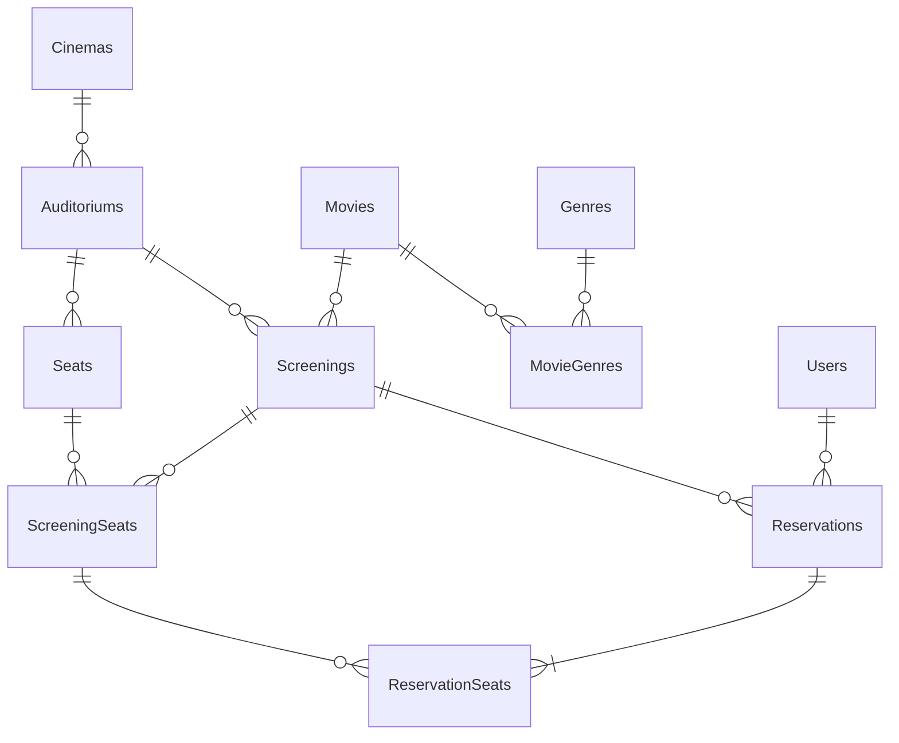

# 무비패스 영화 예매 관리 서비스 — 1차 기획서

## 1. 프로젝트 주제

영화와 상영 일정을 조회하고 좌석을 예매·취소하는 **영화 예매 관리 웹 서비스**.
관리자는 영화·영화관·상영 일정을 관리하고 예매 현황을 확인한다.

## 2. 비즈니스 모델

- **대상:** 여러 지점과 상영관을 운영하는 영화관
- **제공 가치:** 지점·상영관·회차별 좌석 판매를 한 곳에서 관리하고, 예매 현황을 데이터로 확인할 수 있다.
- **수익 구조(가정):** 영화관이 예매 관리 시스템으로 도입하고, 관객은 온라인으로 좌석을 직접 예매한다. 실제 결제·수수료는 이번 프로젝트 범위에서 제외한다.

## 3. 해결하고자 하는 문제

- **좌석 중복 판매:** 여러 관객이 같은 회차의 같은 좌석을 동시에 고르면 한 좌석이 두 번 팔릴 수 있다.
  → 회차별 좌석(`ScreeningSeats`)과 예매 기록(`ReservationSeats`)을 분리한다. 한 회차 좌석에 `BOOKED` 상태의 예매 기록은 최대 하나만 허용하는 방식으로 설계한다. 동시 요청을 안전하게 처리하는 구체적인 방법은 트랜잭션 학습 후 검토한다.
- **회차 선택의 번거로움:** 영화·지점·시간·남은 좌석을 한 번에 비교하기 어려워 원하는 회차를 고르기 번거롭다.
  → 영화·날짜·지점으로 회차를 찾고, 회차별 남은 좌석을 바로 보여 준다.

## 4. 주요 사용자

| 사용자 | 하는 일 |
|---|---|
| 관객 | 영화 검색, 상영 일정 조회, 좌석 확인, 예매·취소, 예매 내역 확인 |
| 관리자 | 영화·장르·영화관·상영관·좌석·상영 일정 등록 및 수정, 예매 현황 확인 |

## 5. 핵심 기능

1. **영화·상영 일정 조회:** 영화, 날짜, 영화관으로 상영 회차를 찾는다.
2. **회차별 좌석 확인:** 선택한 회차에서 예매 가능한 좌석을 보여 준다.
3. **좌석 예매:** 좌석 여러 개를 한 번에 예매한다. 좌석별 예매 기록을 `ReservationSeats`에 저장하며, 한 회차 좌석에 활성(`BOOKED`) 예매 기록은 하나만 존재하도록 한다. 여러 좌석 중 일부만 가능할 때의 처리 방식은 구현 전에 확정한다.
4. **예매 취소:** `ReservationSeats`의 예매 기록을 삭제하지 않고 상태를 `CANCELLED`로 바꾼다. 취소 기록은 남으며, 같은 회차 좌석에 새 `BOOKED` 기록을 만들 수 있다.
5. **관리자 대시보드:** 회차별 좌석 점유율, 영화별·지점별·기간별 예매 수를 조회한다.

## 6. 예상 테이블 및 데이터 구조

| 테이블 | 한 행의 의미 |
|---|---|
| `Users` | 사용자 한 명 (관객 또는 관리자) |
| `Movies` | 영화 한 편 |
| `Genres` | 장르 한 종류 |
| `MovieGenres` | 영화 한 편과 장르 한 종류의 연결 |
| `Cinemas` | 영화관 지점 한 곳 |
| `Auditoriums` | 지점 안의 상영관 한 개 |
| `Seats` | 상영관에 있는 물리적 좌석 한 개 |
| `Screenings` | 특정 영화를 특정 상영관에서 상영하는 회차 한 건 |
| `ScreeningSeats` | 특정 회차의 특정 좌석 한 개와 판매 가능 여부 (`AVAILABLE` / `BLOCKED`) |
| `Reservations` | 사용자가 한 회차를 예매한 사건 한 건 |
| `ReservationSeats` | 예매 한 건에 포함된 좌석 예매 기록 한 건 (상태: `BOOKED` / `CANCELLED`) |

**주요 관계**

**설계 포인트**

- `Seats`는 상영관의 물리적 좌석이다. `ScreeningSeats`는 특정 회차에서 판매할 좌석 자리이며, `(screening_id, seat_id)` 조합에 UNIQUE 제약조건을 두어 한 회차·한 좌석 조합당 한 행만 둔다.
- `ScreeningSeats`의 `availability_status`는 판매 가능 여부만 나타낸다. `AVAILABLE`은 판매 가능한 자리, `BLOCKED`는 고장 등으로 판매를 막은 자리다. 예매 여부를 이 컬럼에 저장하지 않는다.
- `ReservationSeats`는 좌석이 예매될 때마다 생기는 기록이다. 예매된 기록은 `BOOKED`, 취소된 기록은 `CANCELLED`로 남긴다. 좌석을 예매할 수 있는지는 `ScreeningSeats.availability_status`가 `AVAILABLE`이고, 해당 행을 참조하는 `BOOKED` 기록이 없을 때로 판단한다.
- 같은 회차 좌석에 `BOOKED` 기록이 최대 하나만 존재하도록 `ReservationSeats(screening_seat_id)`에 `status = 'BOOKED'` 조건의 부분 고유 인덱스를 둘 계획이다. 취소하면 해당 기록은 `CANCELLED`가 되므로 같은 자리를 다시 예매할 수 있다.
- 예매 당시 좌석별 가격은 `ReservationSeats.price_at_booking`에 보존한다.
- 예매 기록 생성과 좌석별 기록 연결이 모두 성공하거나 모두 취소되게 하는 트랜잭션은 필요한 기능으로 파악했다. 구체적인 구현은 트랜잭션을 학습한 뒤 검토한다.
- 영화와 장르는 다대다 관계이므로 `MovieGenres` 연결 테이블을 둔다.

**간단한 좌석 예시**

`Seats`에는 물리적 좌석을 저장하고, `ScreeningSeats`에는 그 좌석이 포함된 회차와 판매 차단 여부를 저장한다.

| 테이블 | ID | 연결 정보 | 상태/좌석 |
|---|---:|---|---|
| `Seats` | 50 | auditorium_id = 2 | H열 5번 |
| `ScreeningSeats` | 500 | screening_id = 19, seat_id = 50 | `AVAILABLE` |

`ScreeningSeats`의 `AVAILABLE`은 판매 가능한 자리라는 뜻이지, 현재 예매가 없다는 뜻은 아니다. 실제 예매 가능 여부는 이 행을 참조하는 `ReservationSeats`에 `BOOKED` 기록이 있는지도 함께 확인한다.

**예시: 같은 회차 좌석의 예매·취소·재예매 기록**

`ScreeningSeats`에는 해당 회차의 좌석 행을 한 번만 만든다. 그 자리를 예매하고 취소한 뒤 다시 예매하면 `ScreeningSeats` 행은 그대로이고, `ReservationSeats`에 예매 기록이 계속 쌓인다.

| ReservationSeats 행 | reservation_id | screening_seat_id | status |
|---:|---|---:|---|
| 1 | A의 예매 | 500 | `CANCELLED` |
| 2 | B의 예매 | 500 | `BOOKED` |

같은 `screening_seat_id`에 `BOOKED` 상태는 최대 한 행만 허용한다. 이 규칙을 부분 고유 인덱스로 구현하는 방안을 검토한다.

## 7. 향후 구현 계획

| 단계 | 내용 |
|---|---|
| 1 | 미확정 정책 확인 (일부 좌석 취소, 취소 가능 시한, 좌석 등급별 가격, 회차 시간 겹침 방지) |
| 2 | ERD와 테이블 명세 확정 (타입, NULL 허용, 제약조건) |
| 3 | PostgreSQL 테이블 생성 |
| 4 | 샘플 데이터 입력 (영화 10편, 지점 2~3곳, 사용자 10명, 예매 20건 이상, 취소·다중 좌석 사례 포함) |
| 5 | `ReservationSeats`의 활성 예매 중복 방지 규칙과 트랜잭션 적용 검증 |
| 6 | 조회·예매·취소 기능과 대시보드 집계 SQL 구현 |
| 7 | 웹앱 화면에서 주요 기능 시연 |
